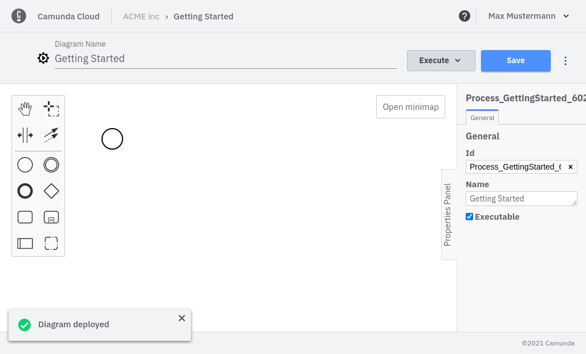
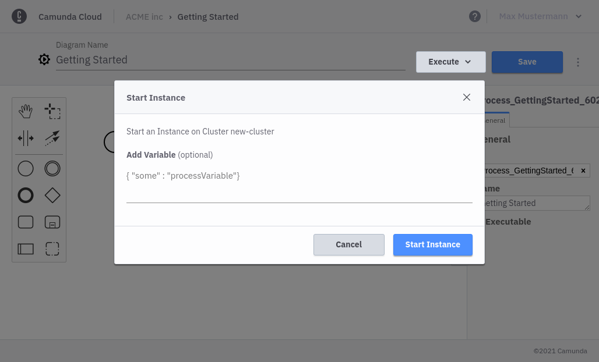
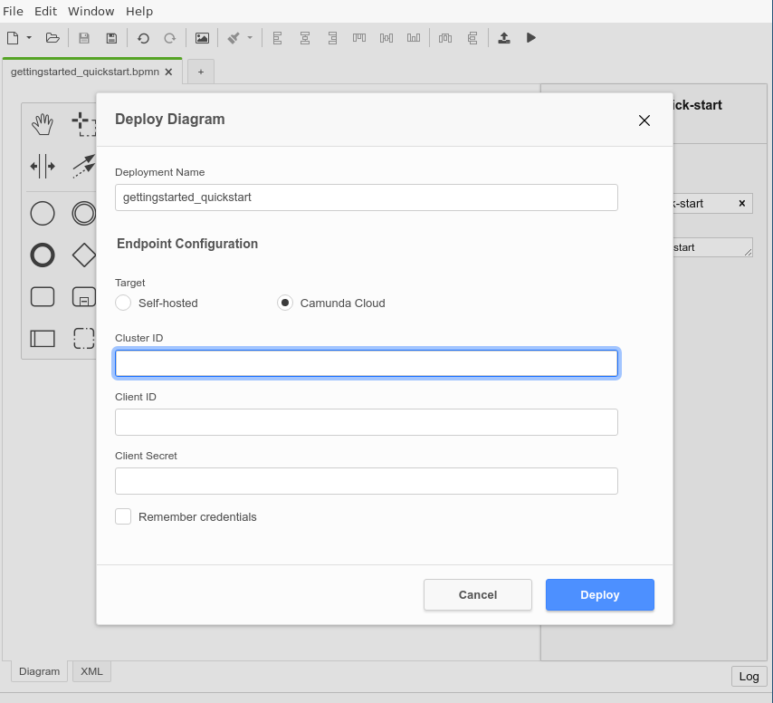
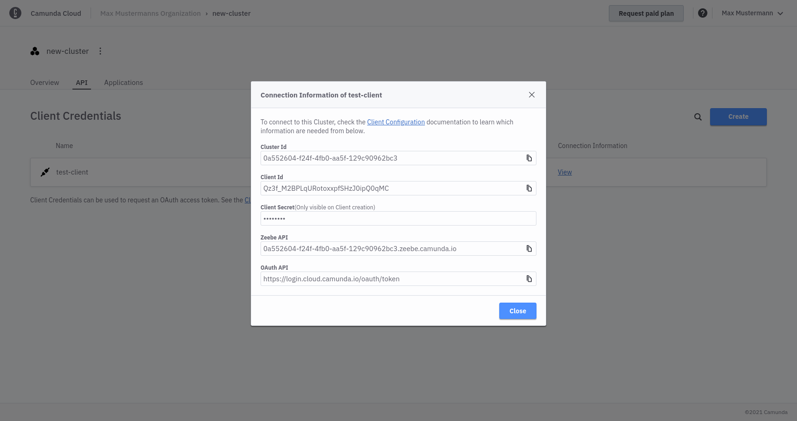

import Tabs from "@theme/Tabs";
import TabItem from "@theme/TabItem";

<Tabs groupId="modeler" defaultValue="console" values={
[
{label: 'Console Modeler', value: 'console', },
{label: 'Zeebe Modeler', value: 'desktop', },
]
}>

<TabItem value='console'>

You can now use the **Save & Deploy** option in the **Deployment** menu to deploy the newly created process to your cluster.


Deployment can take a few seconds, but you should get a confirmation for successful deployment.



You can now start a new process instance. For this example you can just start an instance with an empty payload.



Once the instance is started, you'll get a confirmation with a link to open Operate.


</TabItem>

<TabItem value='desktop'>

On the right side of the navigation menu there are buttons for deploying and starting processes.



In the deployment dialog, the connection information must now be specified: `Cluster Id`, `Client Id` and `Client Secret`.

`Client Id` and `Cluster Id` can be retrieved by clicking on **View** on the client in the **API** tab.



The `Client Secret` can be retrieved from the downloaded connection file:

```bash
grep SECRET  ~/Downloads/CamundaCloudMgmtAPI-Client-test-client.txt
export ZEEBE_CLIENT_SECRET='zbzsZI_6UnCsH_CIo0lNUN8qGyvLJr9VrH77ewNm8Oq3elvhPvV7g.QmJGydzOLo'
```

Click **Deploy** to deploy the process. Use **Play** from the navigation to start a new instance.

</TabItem>
</Tabs>
