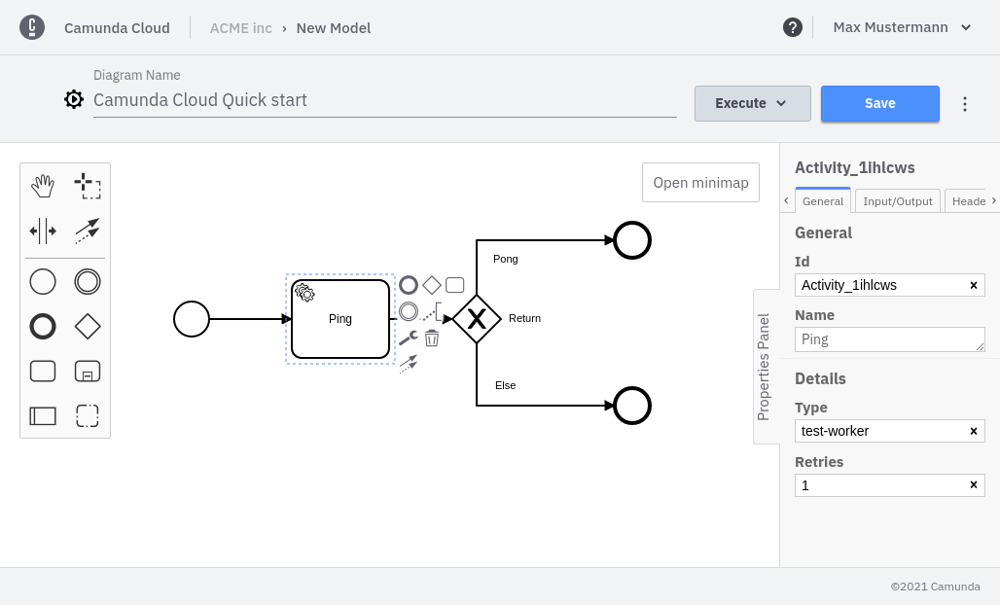

import Tabs from '@theme/Tabs';
import TabItem from '@theme/TabItem';

Use [this workflow model](./bpmn/gettingstarted_quickstart_advanced.bpmn) for the tutorial.

<Tabs groupId="modeler" defaultValue="console" values={
[
{label: 'Console Modeler', value: 'console', },
{label: 'Zeebe Modeler', value: 'desktop', },
]
}>

<TabItem value='console'>

Click **Import Diagram** in the **More** menu to inject the BPMN-model you just downloaded into the diagram.


This workflow includes a service task and an XOR gateway. Select the service task and fill in the properties. Set the **Type** to `test-worker`.



Deploy the new workflow using the **Save & Deploy** option in the **Deployment** menu.

Make sure you have [created a client](./setup-client-connection-credentials.md) and [connected a cluster](connect-to-your-cluster.md).

</TabItem>

<TabItem value='desktop'>


This workflow includes a service task and an XOR gateway. Select the service task and fill in the properties. Set the **Type** to `test-worker`.


Deploy the new workflow.

</TabItem>
</Tabs>

Now you can connect a worker for the configured service task:

```bash
zbctl create worker test-worker --handler "echo {\"return\":\"Pong\"}"
```
