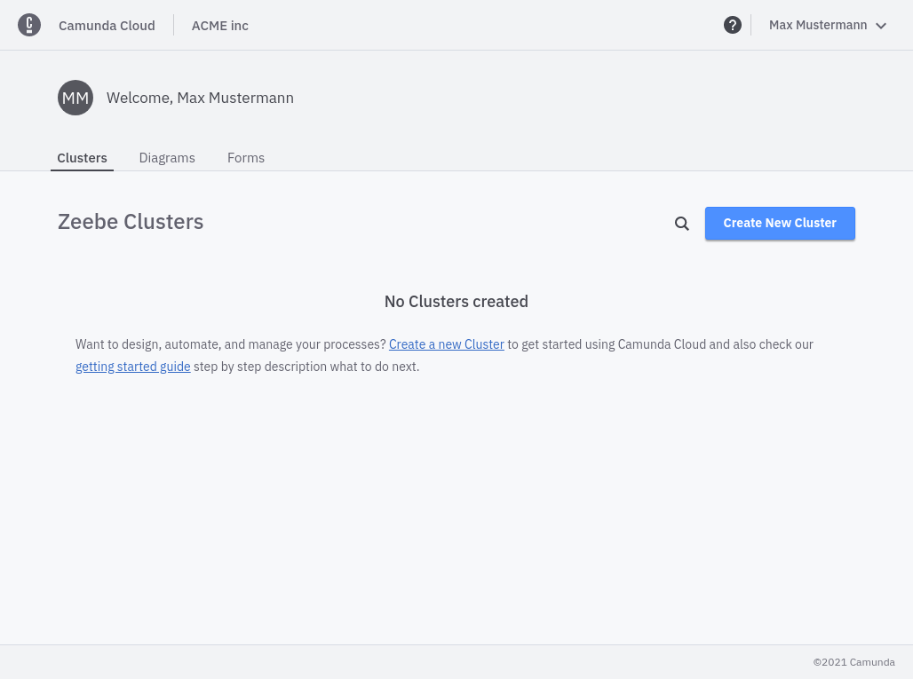
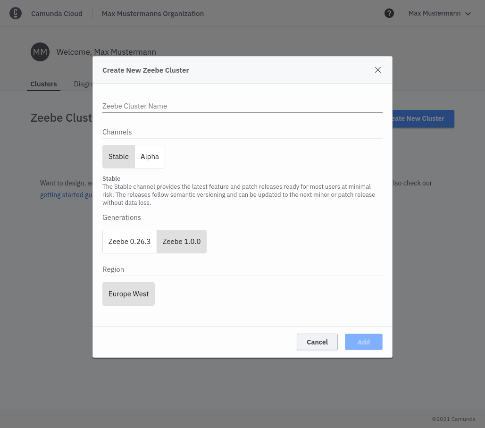
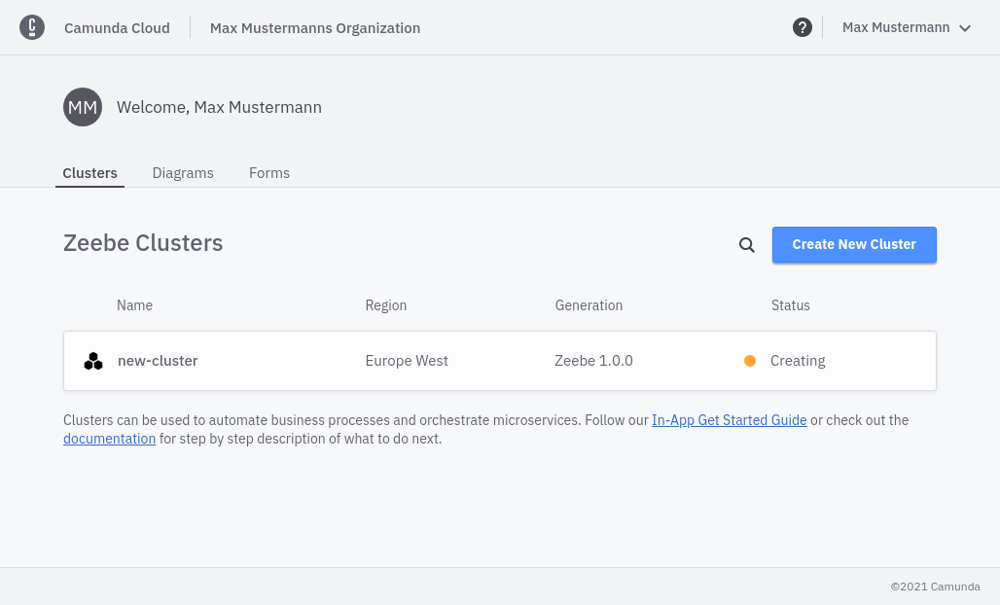

---
---

After login you'll see the console overview page. Since you haven't created a cluster, the overview will be empty.

In the upper right area you'll find the button **Create New Cluster**.

Click on it to create a new cluster. You need to set a name and choose the Channel. Right now there are two Channels available:

- **Stable**: provides the latest feature and patch releases ready for most users at minimal risk. The releases follow semantic versioning and can be updated to the next minor or patch release without data loss.
- **Alpha**: provides preview releases in preparation for the next stable release. They provide a short-term-stable point to test new features and give feedback before they are released to the stable channel. Try these to make sure the upcoming release works well in your infrastructure. These releases cannot be updated to a newer release and therefore are not meant to be used in production.

After you've made your selection and created the cluster, a new entry appears in the overview:

The cluster is now being set up. During this phase, its state is _Creating_. After one or two minutes the cluster is ready for use and changes its state to _Healthy_:

After the cluster has been created, you can jump into the cluster detail page by clicking on the cluster name.
