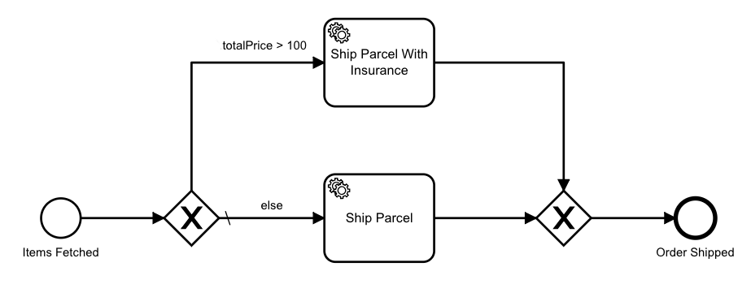

Processes are flowchart-like blueprints that define the orchestration of _tasks_. Every task represents a piece of business logic such that the ordered execution produces a meaningful result.

A _job worker_ implements the business logic required to complete a task. A job worker must be able to communicate with Camunda Cloud, but otherwise, there are no restrictions on its implementation. You can choose to write a worker as a microservice, but also as part of a classical three-tier application, as a \(lambda\) function, via command line tools, etc.

Running a process then requires three steps:

- Deploy a process to Camunda Cloud
- Implement and register job workers for tasks in the worklfows
- Create new instances of said process

But let us not get ahead of ourselves. The very first step is to design the process.

## BPMN 2.0

Zeebe uses [BPMN 2.0](http://www.bpmn.org/) for representing processes. BPMN is an industry standard which is widely supported by different vendors and implementations. Using BPMN ensures that processes can be interchanged between Zeebe and other process systems.

## BPMN modeler

Zeebe provides a free and open-source BPMN modeling tool to create BPMN diagrams and configure their technical properties. The modeler is a desktop application based on the [bpmn.io](https://bpmn.io) open source project.

Zeebe Modeler can be [downloaded from GitHub](https://github.com/zeebe-io/zeebe-modeler/releases).

## Sequences

The simplest kind of process is an ordered sequence of tasks. Whenever process execution reaches a task, Zeebe (the workflow engine inside Camunda Cloud) creates a job that can be requested and completed by a job worker.

You can think of Zeebe's process orchestration as a state machine. A process instance reaches a task, and Zeebe creates a job that can be requested by a worker. Zeebe then waits for the worker to request a job and complete the work. Once the work is completed, the flow continues to the next step. If the worker fails to complete the work, the process remains at the current step, and the job could be retried until it's successfully completed.

## Data flow

As Zeebe progresses from one task to the next in a process, it can move custom data in the form of variables. Variables are key-value-pairs and part of the process instance.

Any job worker can read the variables and modify them when completing a job so that data can be shared between different tasks in a process.

## Data-based conditions

Some processes do not always execute the same tasks but need to choose different tasks based on variables and conditions:

The diamond shape with the "X" in the middle is an element indicating that the process decides to take one of several paths.

## Events

Events represent things that happen. A process can react to events (catching event) and can emit events (throwing event). For example:

There are different types of events such as message, timer or error.

## Parallel execution

In many cases, it is also useful to perform multiple tasks in parallel. This can be achieved with a parallel gateway:

The diamond shape with the "+" marker means that all outgoing paths are activated. The tasks on those paths can run in parallel. The order is only fulfilled after both tasks have completed.
