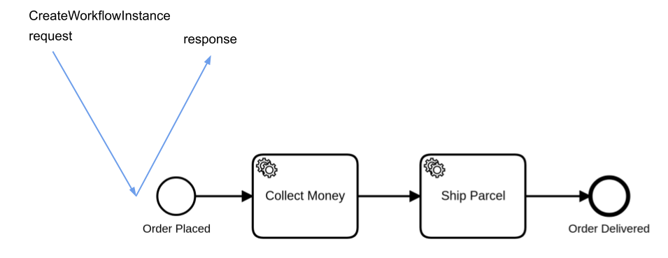

Depending on the workflow definition, an instance of it can be created in the following ways

- _create workflow instance_ commands
- timer event handler
- message event

## Commands

A workflow instance can be created by sending a command specifying the BPMN process id or the unique key of the workflow.
There are two commands to create a workflow instance.

### Create and Execute Asynchronously

A workflow that has a [none start event](/reference/bpmn-workflows/none-events/none-events.md#none-start-events) can be started explicitly using the command [CreateWorkflowInstance](/reference/grpc.md#createworkflowinstance-rpc).
The command creates a new workflow instance and immediately responds with the workflow instance id. The execution of the workflow happens after the response is send.



 <details>
   <summary>Code example</summary>
   <p>Create a workflow instance:

```
zbctl create instance "order-process"
```

Response:

```
{
 "workflowKey": 2251799813685249,
 "bpmnProcessId": "order-process",
 "version": 1,
 "workflowInstanceKey": 2251799813686019
}

```

   </p>
 </details>

### Create and Await Results

Typically, workflow creation and execution are decoupled.
However, there are use-cases that need to collect the results of a workflow when it's execution is completed.
The [CreateWorkflowInstanceWithResult](/reference/grpc.md#createworkflowinstancewithresult-rpc) command allows you to “synchronously” execute workflows and receive the results via a set of variables. The response is sent when the workflow execution is completed.


This command is typically useful for short-running workflows and workflows that collect information.
If the workflow mutates system state, or further operations rely on the workflow outcome response to the client, take care to consider and design your system for failure states and retries.
Note that when the client resends the command, it creates a new workflow instance.

<details>
  <summary>Code example</summary>
  <p>Create a workflow instance and await results:

```
zbctl create instance "order-process" --withResult --variables '{"orderId": "1234"}'
```

Response: (Note that the variables in the response depend on the workflow.)

```
{
  "workflowKey": 2251799813685249,
  "bpmnProcessId": "order-process",
  "version": 1,
  "workflowInstanceKey": 2251799813686045,
  "variables": "{\"orderId\":\"1234\"}"
}
```

  </p>
</details>

Failure scenarios that are applicable to other commands are applicable to this command, as well. Clients may not get a response in the following cases even if the workflow execution is completed successfully.

- Connection timeout: If the gRPC deadlines are not configured for long request timeout, the connection may be closed before the workflow is completed.
- Network connection loss: This can happen at several steps in the communication chain
- Failover: When the node that is processing this workflow crashed, another node continues the processing. But that other node does not send the response because the request is registered on the first one.
- Gateway failure: If the gateway to which the client is connected fails, nodes inside the cluster cannot send the response to the client.

## Events

Workflow instances are also created implicitly via various start events. Camunda Cloud supports message start events and timer start events.

### Message Event

A workflow with a [message start event](/reference/bpmn-workflows/message-events/message-events.md#message-start-events) can be started by publishing a message with the name that matches the message name of the start event.
For each new message a new instance is created.

### Timer Event

A workflow can also have one or more [timer start events](/reference/bpmn-workflows/timer-events/timer-events.md#timer-start-events). An instance of the workflow is created when the associated timer is triggered. Timers can also trigger periodically.
