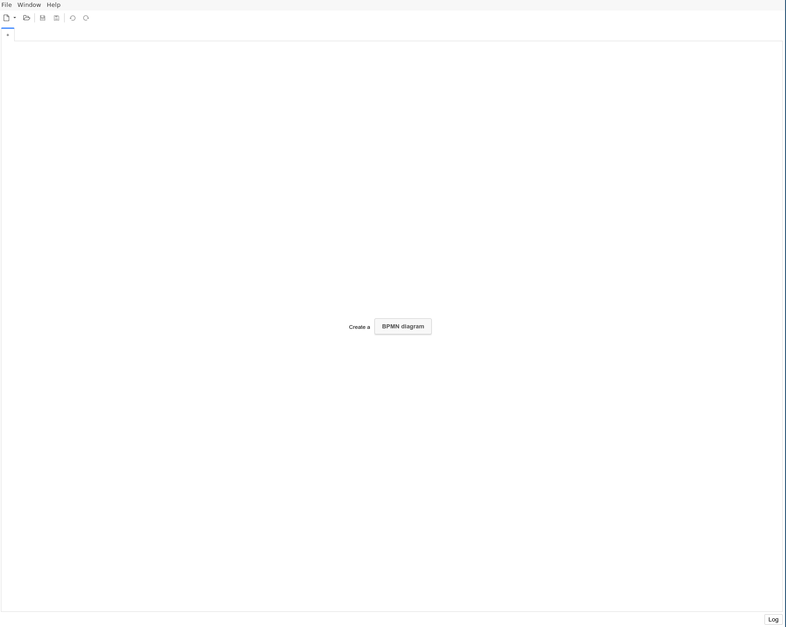
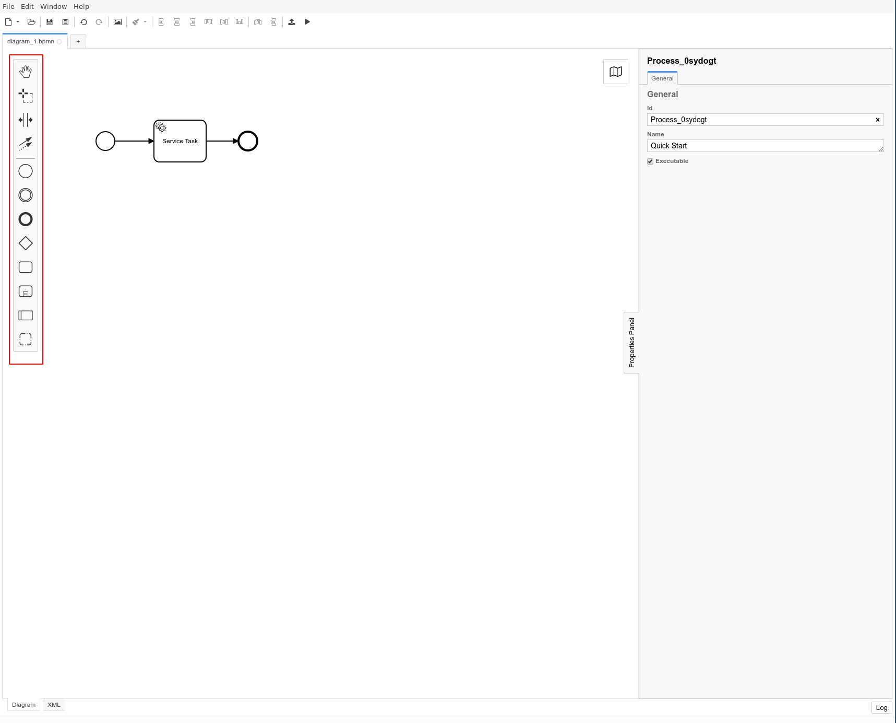
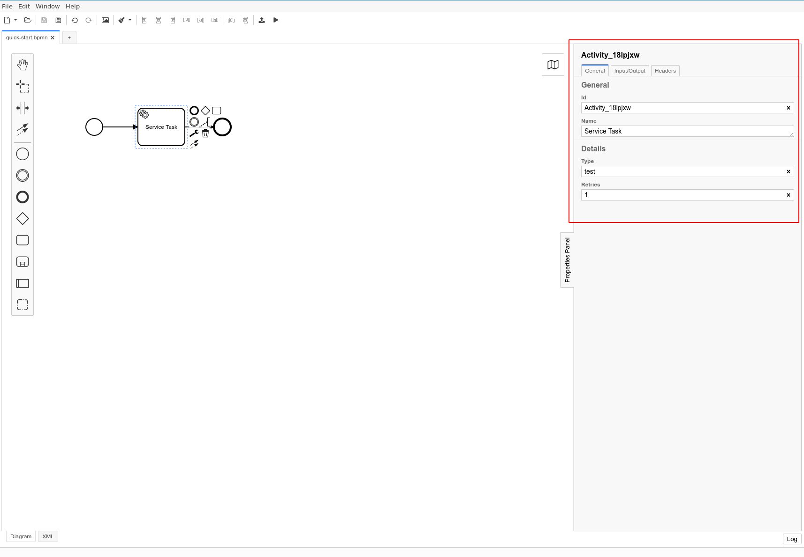

After [downloading](./install-the-modeler.md), setting up and starting the Zeebe Modeler you can model your first BPMN diagram. Create a new BPMN diagram.

Now you see a BPMN diagram with a start event:

As with the [Cloud Modeler](../cloud-modeler/model-your-first-diagram.md), you can now add new elements. On the left side you will find the element palette that is supported by the engine. You can drag and drop the elements into the diagram.

Elements that support different types can be reconfigured by clicking on the corresponding icon. In the following screenshot a task has been added to the diagram. It can be converted to a service task, for example.

Each element has certain attributes that can be changed. The properties panel is located on the right side.

Once you have finished modeling and configuring your diagram, you can save it as BPMN or deploy it on a [Camunda Cloud Cluster](./connect-to-camunda-cloud.md) (of course you can also export the diagram as an image).
