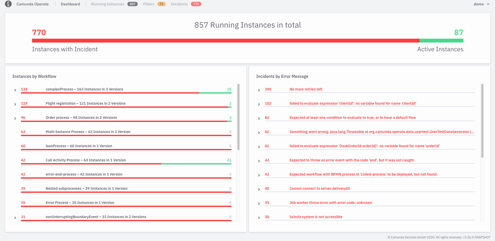

## Running via Docker (local development)

The easiest way to run Operate in development is with Docker. This gives you a consistent, reproducible environment and an out-of-the-box integrated experience for experimenting with Zeebe and Operate.

To do this, you need [Docker Desktop](https://www.docker.com) installed on your development machine.

The [zeebe-docker-compose](https://github.com/zeebe-io/zeebe-docker-compose) repository contains an [operate](https://github.com/zeebe-io/zeebe-docker-compose/tree/master/operate) profile that starts a single Zeebe broker with Operate and all its dependencies. **See the README file in the repository for instructions to start Zeebe and Operate using Docker.**

If you are using Docker, once you follow the instructions in the repository, skip ahead to the section ["Access the Operate Web Interface”](#access-the-operate-web-interface).

## Running with Kubernetes (production)

We will update this section after Operate is available for production use. 

Running Operate with Kubernetes will be recommended for production deployments. 

## Manual Configuration (local development)

Here, we’ll walk you through how to download and run an Operate distribution manually, without using Docker. 

Note that the Operate web UI is available by default at [http://localhost:8080](http://localhost:8080), so please be sure this port is available. 


### Download Operate and a compatible version of Zeebe.

[Operate and Zeebe distributions are available for download on the same release page. ](https://github.com/zeebe-io/zeebe/releases) 

Note that each version of Operate is compatible with a specific version of Zeebe. 

On the Zeebe release page, compatible versions of Zeebe and Operate are grouped together. Please be sure to download and use compatible versions. This is handled for you if you use the Docker profile from our repository. 

### Download Elasticsearch

Operate uses open-source Elasticsearch as its underlying data store, and so to run Operate, you need to download and run Elasticsearch. 

Operate is currently compatible to Elasticsearch 6.8.13. [You can download Elasticsearch here.](https://www.elastic.co/downloads/past-releases/elasticsearch-6-8-13) 

### Run Elasticsearch

To run Elasticsearch, execute the following commands in Terminal or another command line tool of your choice:

```
cd elasticsearch-*
bin/elasticearch
```

You’ll know Elasticsearch has started successfully when you see a message similar to:

```
[INFO ][o.e.l.LicenseService     ] [-IbqP-o] license [72038058-e8ae-4c71-81a1-e9727f2b81c7] mode [basic] - valid
```

### Run Zeebe 

To run Zeebe, execute the following commands:


```
cd zeebe-broker-*
./bin/broker
```


You’ll know Zeebe has started successfully when you see a message similar to:


```
[partition-0] [0.0.0.0:26501-zb-actors-0] INFO  io.zeebe.raft - Joined raft in term 0
[exporter] [0.0.0.0:26501-zb-actors-1] INFO  io.zeebe.broker.exporter.elasticsearch - Exporter opened
```

### Run Operate

To run Operate, execute the following commands:

```
cd camunda-operate-distro-0.26.0-*
bin/operate
```

You’ll know Operate has started successfully when you see messages similar to:

```
DEBUG 1416 --- [       Thread-6] o.c.o.e.w.BatchOperationWriter           : 0 operations locked
DEBUG 1416 --- [       Thread-4] o.c.o.z.ZeebeESImporter                  : Latest loaded position for alias [zeebe-record-deployment] and partitionId [0]: 0
INFO 1416 --- [       Thread-4] o.c.o.z.ZeebeESImporter                  : Elasticsearch index for ValueType DEPLOYMENT was not found, alias zeebe-record-deployment. Skipping.
```

## Access the Operate web interface

The Operate web interface is available at [http://localhost:8080](http://localhost:8080). 

The first screen you'll see is a sign-in page. Use the credentials `demo` / `demo` to sign in. 

After you sign in, you'll see an empty dashboard if you haven't yet deployed any processes:


If you _have_ deployed processes or created process instances, you'll see those on your dashboard:


