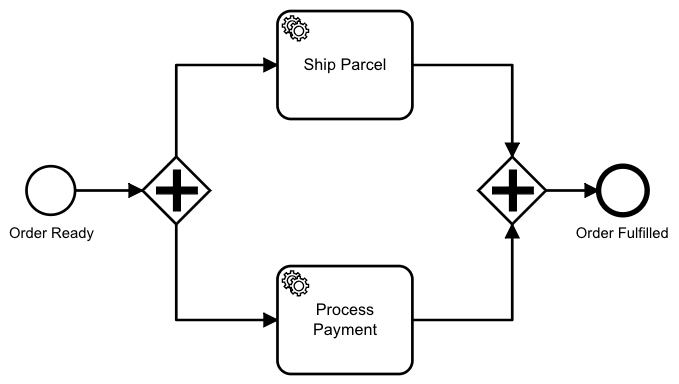

Workflows are flowchart-like blueprints that define the orchestration of _tasks_. Every task represents a piece of business logic such that the ordered execution produces a meaningful result.

A _job worker_ is your implementation of the business logic required to complete a task. A job worker must embed a Zeebe client library to communicate with the broker, but otherwise, there are no restrictions on its implementation. You can choose to write a worker as a microservice, but also as part of a classical three-tier application, as a \(lambda\) function, via command line tools, etc.

Running a workflow then requires two steps: submitting the workflow to Zeebe and creating job workers that can request jobs from Zeebe and complete them.

## Sequences

The simplest kind of workflow is an ordered sequence of tasks. Whenever workflow execution reaches a task, Zeebe creates a job that can be requested and completed by a job worker.

You can think of Zeebe's workflow orchestration as a state machine. A workflow instance reaches a task, and Zeebe creates a job that can be requested by a worker. Zeebe then waits for the worker to request a job and complete the work. Once the work is completed, the flow continues to the next step. If the worker fails to complete the work, the workflow remains at the current step, and the job could be retried until it's successfully completed.

## Data Flow

As Zeebe progresses from one task to the next in a workflow, it can move custom data in the form of variables. Variables are key-value-pairs and part of the workflow instance.

Every job worker can read the variables and modify them when completing a job so that data can be shared between different tasks in a workflow.

## Data-based Conditions

Some workflows do not always execute the same tasks but need to choose different tasks based on variables and conditions:

The diamond shape with the "X" in the middle is an element indicating that the workflow decides to take one of many paths.

## Events

Events represent things that happen. A workflow can react to events (catching event) and can emit events (throwing event). For example:

There are different types of events such as message or timer.

## Fork / Join Concurrency

In many cases, it is also useful to perform multiple tasks in parallel. This can be achieved with Fork / Join concurrency:

The diamond shape with the "+" marker means that all outgoing paths are activated and all incoming paths are merged.

## BPMN 2.0

Zeebe uses [BPMN 2.0](http://www.bpmn.org/) for representing workflows. BPMN is an industry standard which is widely supported by different vendors and implementations. Using BPMN ensures that workflows can be interchanged between Zeebe and other workflow systems.

## BPMN Modeler

Zeebe provides a free and open-source BPMN modeling tool to create BPMN diagrams and configure their technical properties. The modeler is a desktop application based on the [bpmn.io](https://bpmn.io) open source project.

Zeebe Modeler can be [downloaded from GitHub](https://github.com/zeebe-io/zeebe-modeler/releases).
