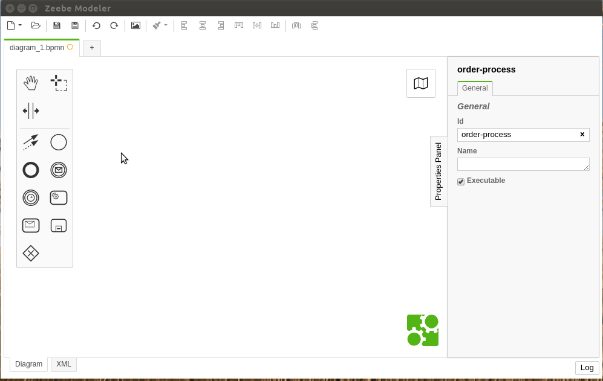
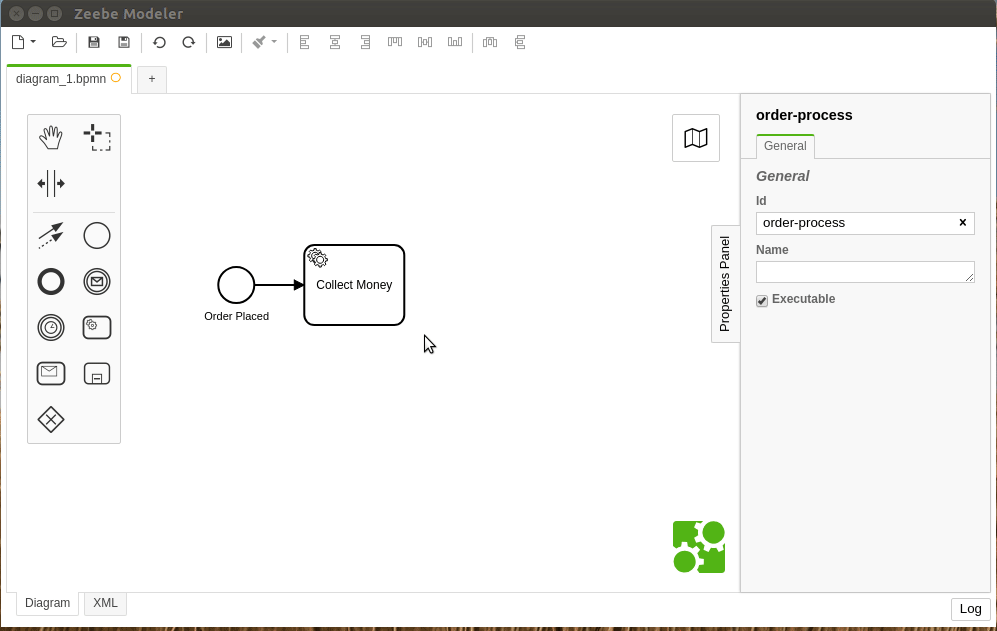

# None Events

None events are unspecified events, also called ‘blank’ events.


## None Start Events

A workflow can have at most one none start event (besides other types of start events).

A none start event is where the workflow instance or a subprocess starts when the workflow or the subprocess is activated.

## None End Events

A workflow or subprocess can have multiple none end events. When a none end event is entered then the current execution path ends. If the workflow instance or subprocess has no more active execution paths then it is completed.

If an activity has no outgoing sequence flow then it behaves the same as it would be connected to a none end event. When the activity is completed then the current execution path ends.

## Additional Resources

<details>
  <summary>XML representation</summary>
  <p>A none start event:

```xml
<bpmn:startEvent id="order-placed" name="Order Placed" />
```

A none end event:
```xml
<bpmn:endEvent id="order-delivered" name="Order Delivered" />
```

  </p>
</details>

<details>
  <summary>Using the BPMN modeler</summary>
  <p>Adding a none start event:

 

Adding a none end event:

 
  </p>
</details>

<details>
  <summary>Workflow Lifecycle</summary>
  <p>Workflow instance records of a none start event: 

<table>
    <tr>
        <th>Intent</th>
        <th>Element Id</th>
        <th>Element Type</th>
    </tr>    
    <tr>
        <td>ELEMENT_ACTIVATING</td>
        <td>order-placed</td>
        <td>START_EVENT</td>
    </tr>
    <tr>
        <td>ELEMENT_ACTIVATED</td>
        <td>order-placed</td>
        <td>START_EVENT</td>
    </tr>
    <tr>
        <td>ELEMENT_COMPLETING</td>
        <td>order-placed</td>
        <td>START_EVENT</td>
    </tr>
    <tr>
        <td>ELEMENT_COMPLETED</td>
        <td>order-placed</td>
        <td>START_EVENT</td>
    </tr>
</table>

Workflow instance records of a none end event: 

<table>
    <tr>
        <th>Intent</th>
        <th>Element Id</th>
        <th>Element Type</th>
    </tr>    
    <tr>
        <td>ELEMENT_ACTIVATING</td>
        <td>order-delivered</td>
        <td>END_EVENT</td>
    </tr>
    <tr>
        <td>ELEMENT_ACTIVATED</td>
        <td>order-delivered</td>
        <td>END_EVENT</td>
    </tr>
    <tr>
        <td>ELEMENT_COMPLETING</td>
        <td>order-delivered</td>
        <td>END_EVENT</td>
    </tr>
    <tr>
        <td>ELEMENT_COMPLETED</td>
        <td>order-delivered</td>
        <td>END_EVENT</td>
    </tr>
</table>

  </p>
</details>
