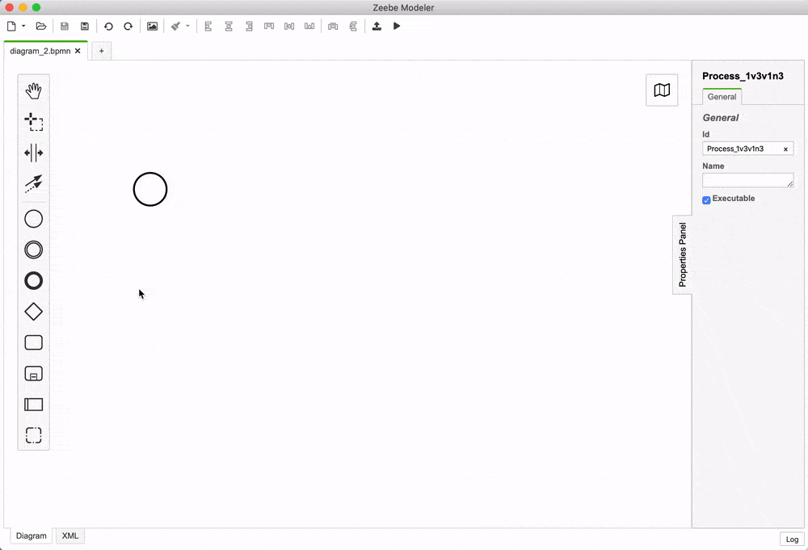
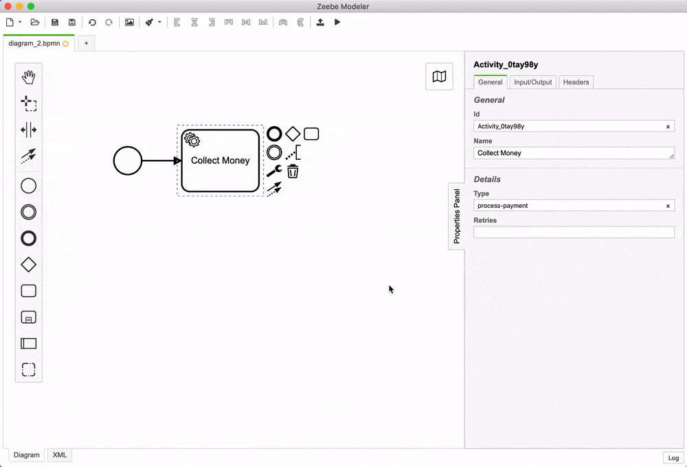
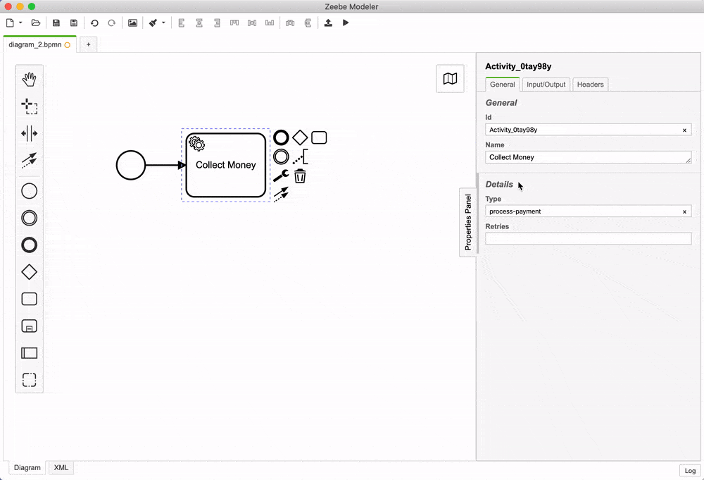

# Service Tasks

A service task represents a work item in the workflow with a specific type.


When a service task is entered then a corresponding job is created. The workflow instance stops at this point and waits until the job is completed.

A worker can subscribe to the job type, process the jobs and complete them using one of the Zeebe clients. When the job is completed, the service task gets completed and the workflow instance continues.

## Task Definition

A service task **must** have a `taskDefinition`. It specifies the **type of job** which workers can subscribe to.

Optionally, a `taskDefinition` can specify the number of times the job is retried when a worker signals failure (default = 3).

Usually, the job type and the job retries are defined as static values (e.g. `order-items`) but they can also be defined as [expressions](../../reference/expressions.md) (e.g. `= "order-" + priorityGroup`). The expressions are evaluated on activating the service task and must result in a `string` for the job type and a `number` for the retries.

## Task Headers

A service task can define an arbitrary number of `taskHeaders`. They are static metadata that are handed to workers along with the job. The headers can be used as configuration parameters for the worker.

## Variable Mappings

By default, all job variables are merged into the workflow instance. This behavior can be customized by defining an output mapping at the service task.

Input mappings can be used to transform the variables into a format that is accepted by the job worker.

## Additional Resources

<details>
  <summary>XML representation</summary>
  <p>A service task with a custom header:

```xml
<bpmn:serviceTask id="collect-money" name="Collect Money">
  <bpmn:extensionElements>
    <zeebe:taskDefinition type="payment-service" retries="5" />
    <zeebe:taskHeaders>
      <zeebe:header key="method" value="VISA" />
    </zeebe:taskHeaders>
  </bpmn:extensionElements>
</bpmn:serviceTask>
```

  </p>
</details>

<details>
  <summary>Using the BPMN modeler</summary>
  <p>Adding a service task:



Adding custom headers:


Adding variable mappings:

  </p>
</details>

<details>
  <summary>Workflow Lifecycle</summary>
  <p>Workflow instance records of a service task:

<table>
    <tr>
        <th>Intent</th>
        <th>Element Id</th>
        <th>Element Type</th>
    </tr>
    <tr>
        <td>ELEMENT_ACTIVATING</td>
        <td>collect-money</td>
        <td>SERVICE_TASK</td>
    </tr>
    <tr>
        <td>ELEMENT_ACTIVATED</td>
        <td>collect-money</td>
        <td>SERVICE_TASK</td>
    </tr>
    <tr>
        <td>...</td>
        <td>...</td>
        <td>...</td>
    </tr>
    <tr>
        <td>ELEMENT_COMPLETING</td>
        <td>collect-money</td>
        <td>SERVICE_TASK</td>
    </tr>
    <tr>
        <td>ELEMENT_COMPLETED</td>
        <td>collect-money</td>
        <td>SERVICE_TASK</td>
    </tr>
</table>

  </p>
</details>

References:
* [Job Handling](../../basics/job-workers.md)
* [Expressions](../../reference/expressions.md)
* [Variable Mappings](../../reference/variables.md#inputoutput-variable-mappings)
* [Incidents](../../reference/incidents.md)
