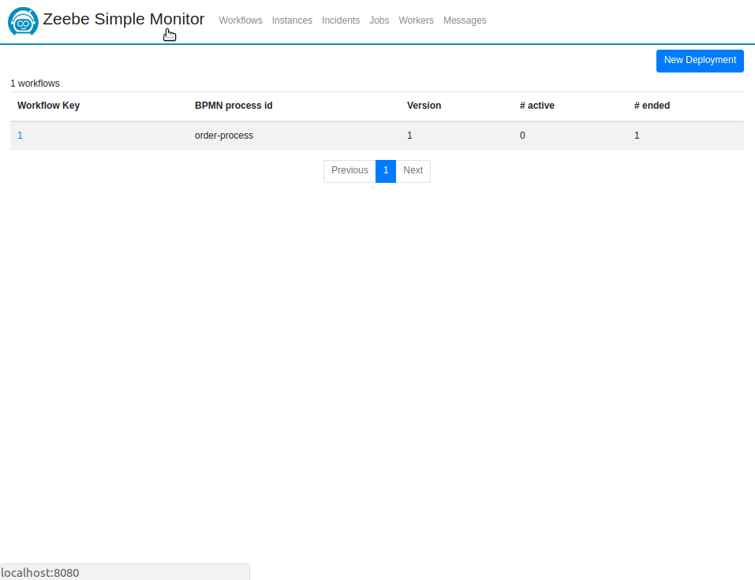
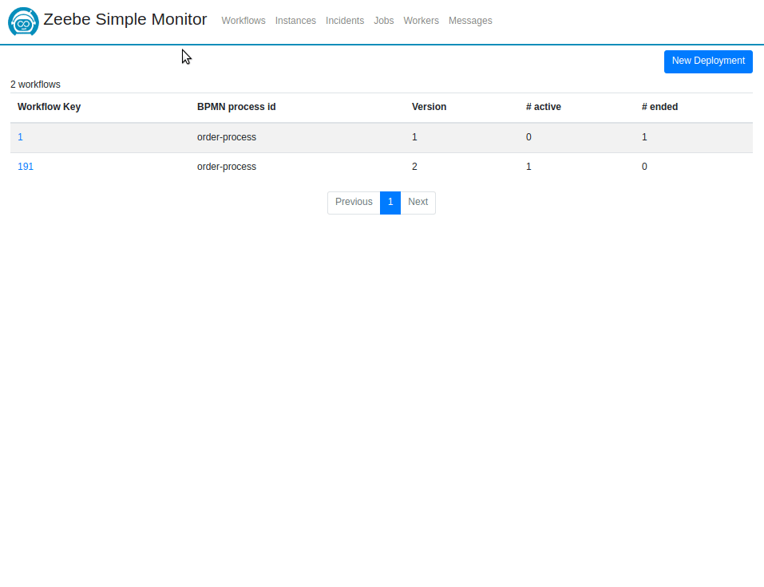
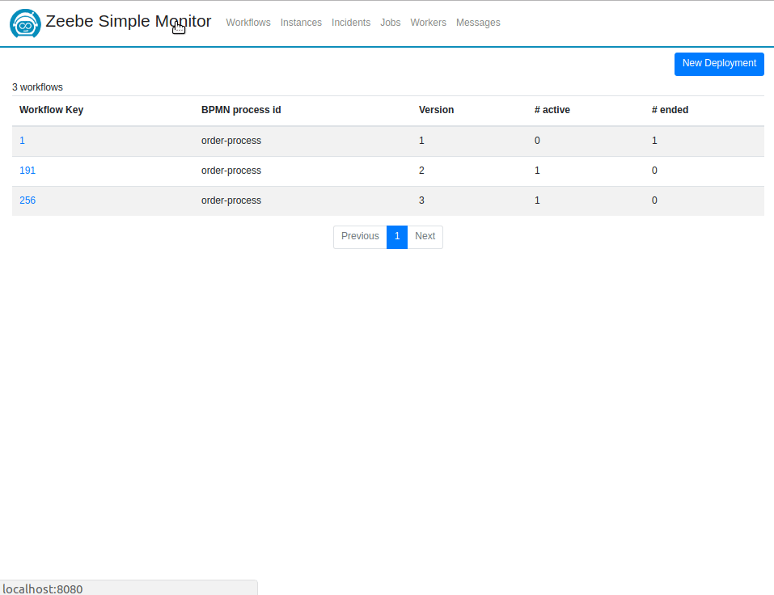

# Get Started with the Java client

In this tutorial, you will learn to use the Java client in a Java application to interact with Zeebe.

You will be guided through the following steps:

* [Set up a project](#set-up-a-project)
* [Model a workflow](#model-a-workflow)
* [Deploy a workflow](#deploy-a-workflow)
* [Create a workflow instance](#create-a-workflow-instance)
* [Work on a job](#work-on-a-job)
* [Work with data](#work-with-data)

> You can find the complete source code, including the BPMN diagrams, on [GitHub](https://github.com/zeebe-io/zeebe-get-started-java-client).

> You can watch a video walk-through of this guide on the [Zeebe YouTube channel here](https://www.youtube.com/watch?v=RV9_7Ct2j0g).

## Prerequisites

* Java 8
* [Apache Maven](https://maven.apache.org/)
* [Zeebe Modeler](https://github.com/zeebe-io/zeebe-modeler/releases)

One of the following:

(Using Docker)
* [Docker](http://www.docker.com)
* [Zeebe Docker Configurations](https://github.com/zeebe-io/zeebe-docker-compose)

(Not using Docker)
* [Zeebe distribution](/introduction/install.html)
* [Zeebe Monitor](https://github.com/zeebe-io/zeebe-simple-monitor/releases)

## Start the broker

Before you begin to setup your project, please start the broker.

If you are using Docker with [zeebe-docker-compose], then change into the `simple-monitor` subdirectory, and run `docker-compose up`.

If you are not using Docker, run the start up script `bin/broker` or `bin/broker.bat` in the distribution.

By default, the broker binds to `localhost:26500`, which is used as contact point in this guide.

## Set up a project

First, we need a Maven project.
Create a new project using your IDE, or run the Maven command:

```
mvn archetype:generate \
    -DgroupId=io.zeebe \
    -DartifactId=zeebe-get-started-java-client \
    -DarchetypeArtifactId=maven-archetype-quickstart \
    -DinteractiveMode=false
```

Add the Zeebe client library as dependency to the project's `pom.xml`:

```xml
<dependency>
  <groupId>io.zeebe</groupId>
  <artifactId>zeebe-client-java</artifactId>
  <version>${zeebe.version}</version>
</dependency>
```

Create a main class and add the following lines to bootstrap the Zeebe client:

```java
package io.zeebe;

import io.zeebe.client.ZeebeClient;

public class App
{
    public static void main(final String[] args)
    {
        final ZeebeClient client = ZeebeClient.newClientBuilder()
            // change the contact point if needed
            .gatewayAddress("127.0.0.1:26500")
            .usePlaintext()
            .build();

        System.out.println("Connected.");

        // ...

        client.close();
        System.out.println("Closed.");
    }
}
```

Run the program:
* If you use an IDE, you can just execute the main class, using your IDE.
* Otherwise, you must build an executable JAR file with Maven and execute it.

## Interlude: Build an executable JAR file

Add the Maven Shade plugin to your pom.xml:

```xml
<!-- Maven Shade Plugin -->
<plugin>
  <groupId>org.apache.maven.plugins</groupId>
  <artifactId>maven-shade-plugin</artifactId>
  <version>2.3</version>
  <executions>
    <!-- Run shade goal on package phase -->
    <execution>
      <phase>package</phase>
      <goals>
        <goal>shade</goal>
      </goals>
      <configuration>
        <transformers>
          <!-- add Main-Class to manifest file -->
          <transformer implementation="org.apache.maven.plugins.shade.resource.ManifestResourceTransformer">
            <mainClass>io.zeebe.App</mainClass>
          </transformer>
        </transformers>
      </configuration>
    </execution>
  </executions>
</plugin>
```

Now run `mvn package`, and it will generate a JAR file in the `target` subdirectory. You can run this with `java -jar target/${JAR file}`.

## Output of executing program

You should see the output:

```
Connected.

Closed.
```

## Model a workflow

Now, we need a first workflow which can then be deployed.
Later, we will extend the workflow with more functionality.

Open the Zeebe Modeler and create a new BPMN diagram.
Add a start event and an end event to the diagram and connect the events.


Set the id (the BPMN process id), and mark the diagram as executable.

Save the diagram as `src/main/resources/order-process.bpmn` under the project's folder.

## Deploy a workflow

Next, we want to deploy the modeled workflow to the broker.

The broker stores the workflow under its BPMN process id and assigns a version.

Add the following deploy command to the main class:

```java
package io.zeebe;

import io.zeebe.client.api.response.DeploymentEvent;

public class Application
{
    public static void main(final String[] args)
    {
        // after the client is connected

        final DeploymentEvent deployment = client.newDeployCommand()
            .addResourceFromClasspath("order-process.bpmn")
            .send()
            .join();

        final int version = deployment.getWorkflows().get(0).getVersion();
        System.out.println("Workflow deployed. Version: " + version);

        // ...
    }
}
```

Run the program and verify that the workflow is deployed successfully.
You should see the output:

```
Workflow deployed. Version: 1
```

## Create a workflow instance

Finally, we are ready to create a first instance of the deployed workflow.
A workflow instance is created of a specific version of the workflow, which can be set on creation.

Add the following create command to the main class:

```java
package io.zeebe;

import io.zeebe.client.api.response.WorkflowInstanceEvent;

public class Application
{
    public static void main(final String[] args)
    {
        // after the workflow is deployed

        final WorkflowInstanceEvent wfInstance = client.newCreateInstanceCommand()
            .bpmnProcessId("order-process")
            .latestVersion()
            .send()
            .join();

        final long workflowInstanceKey = wfInstance.getWorkflowInstanceKey();

        System.out.println("Workflow instance created. Key: " + workflowInstanceKey);

        // ...
    }
}
```

Run the program and verify that the workflow instance is created. You should see the output:

```
Workflow instance created. Key: 2113425532
```

You did it! You want to see how the workflow instance is executed?

If you are running with Docker, just open [http://localhost:8082](http://localhost:8082) in your browser.

If you are running without Docker:
* Start the Zeebe Monitor using `java -jar zeebe-simple-monitor-app-*.jar`.
* Open a web browser and go to <http://localhost:8080/>.

In the Simple Monitor interface, you see the current state of the workflow instance.


## Work on a job

Now we want to do some work within your workflow.
First, add a few service jobs to the BPMN diagram and set the required attributes.
Then extend your main class and create a job worker to process jobs which are created when the workflow instance reaches a service task.

Open the BPMN diagram in the Zeebe Modeler.
Insert a few service tasks between the start and the end event.


You need to set the type of each task, which identifies the nature of the work to be performed.
Set the type of the first task to 'payment-service'.

Set the type of the second task to 'fetcher-service'.

Set the type of the third task to 'shipping-service'.

Save the BPMN diagram and switch back to the main class.

Add the following lines to create a job worker for the first jobs type:

```java
package io.zeebe;

import io.zeebe.client.api.worker.JobWorker;

public class App
{
    public static void main(final String[] args)
    {
        // after the workflow instance is created

        try(final JobWorker jobWorker = client.newWorker()) {
            jobWorker.jobType("payment-service")
            .handler((jobClient, job) ->
            {
                System.out.println("Collect money");

                // ...

                jobClient.newCompleteCommand(job.getKey())
                    .send()
                    .join();
            })
            .open();

            // waiting for the jobs
            // Don't close, we need to keep polling to get work
            // It will be close after last statement in try-with resources block

            // ...
        }

    }
}
```

Run the program and verify that the job is processed. You should see the output:

```
Collect money
```

When you have a look at the Zeebe Monitor, then you can see that the workflow instance moved from the first service task to the next one:



## Work with data

Usually, a workflow is more than just tasks, there is also a data flow. The worker gets the data from the workflow instance to do its work and send the result back to the workflow instance.

In Zeebe, the data is stored as key-value-pairs in form of variables. Variables can be set when the workflow instance is created. Within the workflow, variables can be read and modified by workers.

In our example, we want to create a workflow instance with the following variables:

```json
"orderId": 31243
"orderItems": [435, 182, 376]
```

The first task should read `orderId` as input and return `totalPrice` as result.

Modify the workflow instance create command and pass the data as variables. Also, modify the job worker to read the job variables and complete the job with a result.

```java
package io.zeebe;

public class App
{
    public static void main(final String[] args)
    {
        // after the workflow is deployed

        final Map<String, Object> data = new HashMap<>();
        data.put("orderId", 31243);
        data.put("orderItems", Arrays.asList(435, 182, 376));

        final WorkflowInstanceEvent wfInstance = client.newCreateInstanceCommand()
            .bpmnProcessId("order-process")
            .latestVersion()
            .variables(data)
            .send()
            .join();

        // ...

        final JobWorker jobWorker = client.newWorker()
            .jobType("payment-service")
            .handler((jobClient, job) ->
            {
                final Map<String, Object> variables = job.getVariablesAsMap();

                System.out.println("Process order: " + variables.get("orderId"));
                double price = 46.50;
                System.out.println("Collect money: $" + price);

                // ...

                final Map<String, Object> result = new HashMap<>();
                result.put("totalPrice", price);

                jobClient.newCompleteCommand(job.getKey())
                    .variables(result)
                    .send()
                    .join();
            })
            .fetchVariables("orderId")
            .open();

        // ...
    }
}
```

Run the program and verify that the variable is read. You should see the output:

```
Process order: 31243
Collect money: $46.50
```

When we have a look at the Zeebe Monitor, then we can see that the variable `totalPrice` is set:



## What's next?

Hurray! You finished this tutorial and learned the basic usage of the Java client.

Next steps:
* Learn more about the [concepts behind Zeebe](/basics/)
* Learn more about [BPMN workflows](/bpmn-workflows/)
* Take a deeper look into the [Java client](assets/)

[job worker]: ../basics/job-workers.html
[zeebe-docker-compose]: https://github.com/zeebe-io/zeebe-docker-compose
