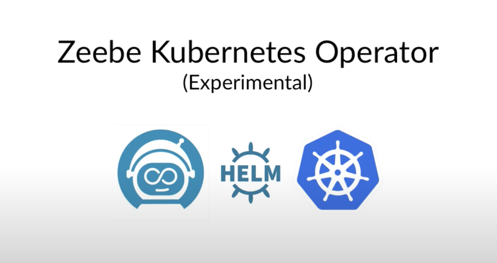
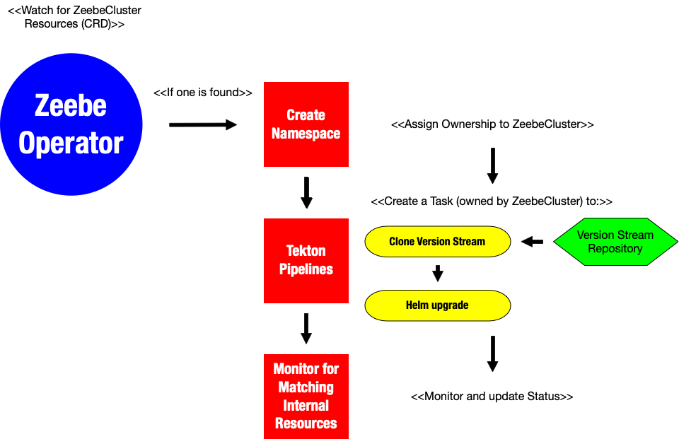

The Zeebe Kubernetes Operator was born out of the need to manage more than one single Zeebe cluster running inside Kubernetes clusters. Zeebe clusters have their own lifecycle and in real implementations, the need to update, monitor, and manage some of these cluster components while applications are running becomes challenging. The objective of the Zeebe Kubernetes Operator is to simplify and natively integrate Zeebe with Kubernetes, to solve operational burden and facilitate the creation and maintenance of a set of clusters. 

This operator has been built with Kubernetes Helm in mind, meaning that at the end of the day, this operator will be in charge of managing [Helm charts](https://github.com/helm/helm). If you are not familiar with Helm, Helm is a package manager for Kubernetes, which help us to package and distribute Kubernetes manifest. Helm also deals with installing, labeling and dependency management between packages (charts). Because we have Zeebe Helm packages already here: [http://helm.zeebe.io](http://helm.zeebe.io) which are automatically versioned and released, the Zeebe Kubernetes Operator will use these charts to create and manage new clusters and other related components. 


Because we are in Kubernetes realms we need to provide a declarative way of stating that we want a new Zeebe cluster to be provisioned. For this reason, the ZeebeCluster Custom Resource Definition (CRD) is introduced. This resource contains all the information needed to provision a cluster and it will also reflect the current cluster status. The Zeebe Kubernetes Operator is built to monitor ZeebeCluster resources and interact with the Kubernetes APIs under the hood to make sure that the Zeebe cluster is provisioned, upgraded or deleted correctly.

## Getting started

The Zeebe Kubernetes Operator can be installed using Helm, as it is provided as a Helm chart as well. In contrast with `zeebe-cluster`, `zeebe-operate` and `zeebe-full` charts, the operator chart installation by itself doesn’t install any Zeebe cluster, but allows you to do that by creating ZeebeCluster CRD resources. 

The following steps will guide you to install the Operator with Helm3  (which is the default version now)

Add the Zeebe Helm repository:

```
helm repo add zeebe https://helm.zeebe.io
helm repo update
```

Now you are ready to install the Zeebe Kubernetes Operator:

```
helm install zeebe-operator zeebe/zeebe-operator
```

Create my-zeebe-cluster.yaml

```
apiVersion: zeebe.zeebe.io/v1
kind: ZeebeCluster
metadata:
  name: my-zeebe-cluster
```

Create the resource within the Kubernetes cluster with:

```
kubectl apply -f my-zeebe-cluster.yaml
```


This will create a new namespace with the name stated in the ZeebeCluster resource ( `ZeebeCluster.metadata.name` ) and provision a new Zeebe Cluster plus ElasticSearch by default.

Future versions will allow you to specify in the ZeebeCluster resource which ElasticSearch instance to use. 

Notice that the first time provisioning a cluster, docker images will  be downloaded to the Kubernetes Docker registry so the first cluster might take more time to be provisioned. 

You can now query for your Zeebe clusters using the `kubectl` CLI:

```
kubectl get zb
```

If you delete the ZeebeCluster resource the actual ZeebeCluster will be automatically removed from your cluster. 
Now you can check that there is a new “Namespace” created with:

```
kubectl get ns
```

And also check that the cluster is correctly provisioned by looking at the Pods created inside the newly created namespace with

```
kubectl get pods -n <Zeebe_Cluster_Name> -w
```

The next video show these commands in action along with the installation of the Zeebe Kubernetes Operator:

[](https://www.youtube.com/watch?v=U-crhMfuJgY)


## Technical details and dependencies

This Kubernetes Operator was built using KubeBuilder V2.1+, Tekton 0.8.0+ and Helm 3.

The Operator Defines currently 1 CRD (Custom Resource Definition): `ZeebeCluster`, but in future versions, new types will be defined for other components such as Zeebe Operate and workers.  The ZeebeCluster resource represent a low-level resource which will instantiate a Zeebe cluster based on predefined parameters. This low-level resource definition can be used to define the cluster topology and HA configurations.

The Zeebe Kubernetes Operator was built using the [kubebuilder framework](https://github.com/kubernetes-sigs/kubebuilder) for writing the controller’s logic and scaffolding the CRD type. Internally it does interact with [Tekton Pipelines](https://github.com/tektoncd/pipeline) in order to install and manage Zeebe Helm charts.  The project itself is being built, released and tested using [Jenkins X](https://jenkins-x.io/). This leads to some changes in how KubeBuilder’s project is structured, as in its current shape the project is not organised in a way that is easy to create a Helm chart out of it.

The main flow of the Operator works like this: 



First, the Operator will be constantly looking for ZeebeCluster resources. When one is found a new Namespace is created and a Tekton Task and TaskRun are created to “upgrade” the Helm charts defined inside the Version Stream repository (hosted here: https://github.com/zeebe-io/zeebe-version-stream-helm ).

This repository (referred as Version Stream Repository) contains a list of blessed versions that will be installed when a new ZeebeCluster resource is detected by the operator. Using a Version Stream repository provides us with the flexibility to evolve the operator code and the charts that define what needs to be provisioned independently. This allows for a simple upgrade path to future versions by using a Git repository as central reference to a stable version.

In future versions, the option to choose a version stream repository will be provided, allowing different streams.

The Task created in Tekton Pipelines execute two basic operations:

- First, clone Version Stream repository (using simple git clone)
Run Helm Upgrade of the chart defined in the Version Stream Repository (it will automatically upgrade/install if it doesn’t exist)

- Then, running Helm upgrade/install will create a Helm release which can be upgraded if new versions of the charts are available. These releases can be queried using the Helm cli tool: ` helm list --all-namespaces`.

Once the task is created an execution is triggered by the creation of a TaskRun (an actual instance of the task) and the operator will monitor for this task to be completed. Once the task is completed, the Operator watches for the Zeebe Cluster to be provisioned. In a more detailed look, the Operator will look for a StatefulSet (Zeebe broker nodes) with a set of labels matching the ZeebeCluster name, inside the created namespace.

Once the StatefulSet is located, the Operator assigns the ZeebeCluster resource as the Owner of this StatefulSet, hence it will be notified about the changes emitted by the resources associated to the StatefulSet. This allows the Operator to externalise a health status of the Zeebe cluster at any given point, understanding the actual state of the cluster itself.
