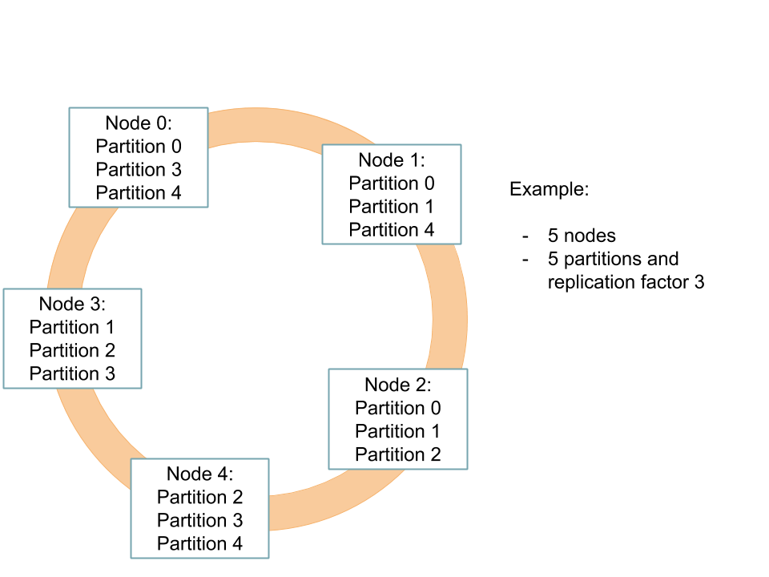

To set up a cluster you need to adjust the `cluster` section
in the Zeebe configuration file. Below is a snippet
of the default Zeebe configuration file, it should be self-explanatory.

```yaml
---
cluster:
  # This section contains all cluster related configurations, to setup a zeebe cluster

  # Specifies the unique id of this broker node in a cluster.
  # The id should be between 0 and number of nodes in the cluster (exclusive).
  #
  # This setting can also be overridden using the environment variable ZEEBE_BROKER_CLUSTER_NODEID.
  nodeId: 0

  # Controls the number of partitions, which should exist in the cluster.
  #
  # This can also be overridden using the environment variable ZEEBE_BROKER_CLUSTER_PARTITIONSCOUNT.
  partitionsCount: 1

  # Controls the replication factor, which defines the count of replicas per partition.
  # The replication factor cannot be greater than the number of nodes in the cluster.
  #
  # This can also be overridden using the environment variable ZEEBE_BROKER_CLUSTER_REPLICATIONFACTOR.
  replicationFactor: 1

  # Specifies the zeebe cluster size. This value is used to determine which broker
  # is responsible for which partition.
  #
  # This can also be overridden using the environment variable ZEEBE_BROKER_CLUSTER_CLUSTERSIZE.
  clusterSize: 1

  # Allows to specify a list of known other nodes to connect to on startup
  # The contact points of the internal network configuration must be specified.
  # The format is [HOST:PORT]
  # Example:
  # initialContactPoints : [ 192.168.1.22:26502, 192.168.1.32:26502 ]
  #
  # To guarantee the cluster can survive network partitions, all nodes must be specified
  # as initial contact points.
  #
  # This setting can also be overridden using the environment variable ZEEBE_BROKER_CLUSTER_INITIALCONTACTPOINTS
  # specifying a comma-separated list of contact points.
  # Default is empty list:
  initialContactPoints: []

  # Allows to specify a name for the cluster
  # This setting can also be overridden using the environment variable ZEEBE_BROKER_CLUSTER_CLUSTERNAME.
  # Example:
  clusterName: zeebe-cluster
```

## Example

In this example, we will set up a Zeebe cluster with
five brokers. Each broker needs to get a unique node id.
To scale well, we will bootstrap five partitions
with a replication factor of three. For more information about this,
please take a look into the [Clustering](/product-manuals/zeebe/technical-concepts/clustering.md) section.

The clustering setup will look like this:



## Configuration

The configuration of the first broker could look like this:

```yaml
---
cluster:
  nodeId: 0
  partitionsCount: 5
  replicationFactor: 3
  clusterSize: 5
  initialContactPoints:
    [
      ADDRESS_AND_PORT_OF_NODE_0,
      ADDRESS_AND_PORT_OF_NODE_1,
      ADDRESS_AND_PORT_OF_NODE_2,
      ADDRESS_AND_PORT_OF_NODE_3,
      ADDRESS_AND_PORT_OF_NODE_4,
    ]
```

For the other brokers the configuration will slightly change.

```yaml
---
cluster:
  nodeId: NODE_ID
  partitionsCount: 5
  replicationFactor: 3
  clusterSize: 5
  initialContactPoints:
    [
      ADDRESS_AND_PORT_OF_NODE_0,
      ADDRESS_AND_PORT_OF_NODE_1,
      ADDRESS_AND_PORT_OF_NODE_2,
      ADDRESS_AND_PORT_OF_NODE_3,
      ADDRESS_AND_PORT_OF_NODE_4,
    ]
```

Each broker needs a unique node id. The ids should be in the range of
zero and `clusterSize - 1`. You need to replace the `NODE_ID` placeholder with an
appropriate value. Furthermore, the
brokers need an initial contact point to start their gossip
conversation. Make sure that you use the address and
**management port** of another broker. You need to replace the
`ADDRESS_AND_PORT_OF_NODE_0` placeholder.

To guarantee that a cluster can properly recover from network partitions,
it is currently required that all nodes be specified as initial contact points. It is not necessary
for a broker to list itself as initial contact point, but it is safe to do so, and probably simpler
to maintain.

## Partitions Bootstrapping

On bootstrap, each node will create a partition matrix.

This matrix depends on the partitions count, replication factor and
the cluster size. If you did the configuration right and
used the same values for `partitionsCount`, `replicationFactor`
and `clusterSize` on each node, then all nodes will generate
the same partition matrix.

For the current example the matrix will look like the following:

<table>
<tr>
    <th></th>
    <th>Node 0</th>
    <th>Node 1</th>
    <th>Node 2</th>
    <th>Node 3</th>
    <th>Node 4</th>
</tr>

<!-- Partition 0 -->
<tr>
 <td><b>Partition 0</b></td>
 <td>Leader</td>
 <td>Follower</td>
 <td>Follower</td>
 <td>-</td>
 <td>-</td>
</tr>

<!-- Partition 1 -->
<tr>
 <td><b>Partition 1</b></td>
 <td>-</td>
 <td>Leader</td>
 <td>Follower</td>
 <td>Follower</td>
 <td>-</td>
</tr>

<!-- Partition 2 -->
<tr>
 <td><b>Partition 2</b></td>
 <td>-</td>
 <td>-</td>
 <td>Leader</td>
 <td>Follower</td>
 <td>Follower</td>
</tr>

<!-- Partition 3 -->
<tr>
 <td><b>Partition 3</b></td>
 <td>Follower</td>
 <td>-</td>
 <td>-</td>
 <td>Leader</td>
 <td>Follower</td>
</tr>

<!-- Partition 4 -->
<tr>
 <td><b>Partition 4</b></td>
 <td>Follower</td>
 <td>Follower</td>
 <td>-</td>
 <td>-</td>
 <td>Leader</td>
</tr>

</table>

The matrix ensures that the partitions are well distributed
between the different nodes. Furthermore, it guarantees that
each node knows exactly, which partitions it has
to bootstrap and for which it will become the leader at first (this
could change later, if the node needs to step down for example).

## Keep Alive Intervals

It's possible to specify how often Zeebe clients should send keep alive pings. By default, the official Zeebe clients (Java and Go) send keep alive pings every 45 seconds. This interval can be configured through the clients' APIs and through the `ZEEBE_KEEP_ALIVE` environment variable. When configuring the clients with the environment variable, the time interval must be expressed a positive amount of milliseconds (e.g., 45000).

It's also possible to specify what is the minimum interval allowed by the gateway before it terminates the connection. By default, gateways terminate connections if they receive more than two pings with an interval less than 30 seconds. This minimum interval can be modified by editing the network section in the respective configuration file or by setting the `ZEEBE_GATEWAY_NETWORK_MINKEEPALIVEINTERVAL` environment variable.
