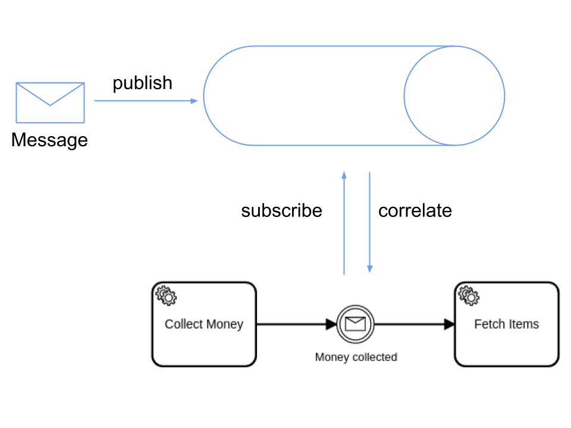
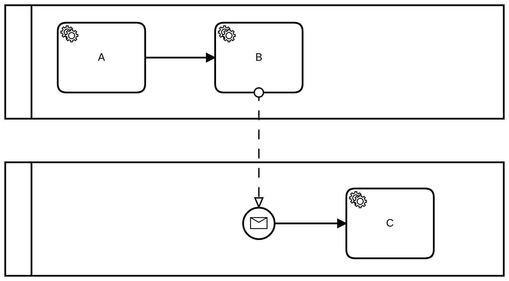

# Message Correlation

Message correlation describes how a message is correlated to a workflow instance. Messages can be correlated to the following elements:

* [Message Start Events](/bpmn-workflows/message-events/message-events.md#message-start-events)
* [Intermediate Message Catch Events](/bpmn-workflows/message-events/message-events.md#intermediate-message-catch-events)
* [Message Boundary Events](/bpmn-workflows/message-events/message-events.md#message-boundary-events)
* [Message Event Subprocesses](/bpmn-workflows/event-subprocesses/event-subprocesses.md)
* [Receive Tasks](/bpmn-workflows/receive-tasks/receive-tasks.md)

## Message Subscriptions

A message is not sent to a workflow instance directly. Instead, the message correlation is based on subscriptions that contains the **message name** and the **correlation key** (aka correlation value).



A subscription is opened when a workflow instance awaits a message, for example, when entering a message catch event. The message name is defined either statically in the workflow (e.g. `Money collected`) or dynamically as an expression. The correlation key is defined dynamically as an expression (e.g. `= orderId`). The expressions are evaluated on activating the message catch event. The results of the evaluations are used as message name and as correlation key of the subscription (e.g. `"order-123"`).

 When a message is published and the message name and the correlation key matches to a subscription then the message is correlated to the corresponding workflow instance. If no proper subscription is opened then the message is discarded.

A subscription is closed when the corresponding element (e.g. the message catch event), or its scope is left. After a subscription is opened, it is not updated, for example, when the referenced workflow instance variable is changed.

<details>
   <summary>Publish message via zbctl</summary>
   <p>

   ```
   zbctl publish message "Money collected" --correlationKey "order-123"
   ```

   </p>
 </details>

## Message Cardinality

A message is correlated only **once** to a workflow (based on the BPMN process id), across all versions of this workflow. If multiple subscriptions for the same workflow are opened (by multiple workflow instances or within one instance) then the message is correlated only to one of the subscriptions.

When subscriptions are opened for different workflows then the message is correlated to **all** of the subscriptions.

A message is **not** correlated to a message start event subscription if an instance of the workflow is active and was created by a message with the same correlation key. If the message is buffered then it can be correlated after the active instance is ended. Otherwise, it is discarded.

## Message Buffering

Messages can be buffered for a given time. Buffering can be useful in a situation when it is not guaranteed that the subscription is opened before the message is published.

A message has a **time-to-live** (TTL) which specifies for how long it is buffered. Within this time, the message can be correlated to a workflow instance.

When a subscription is opened then it polls the buffer for a proper message. If a proper message exists then it is correlated to the corresponding workflow instance. In case multiple messages match to the subscription then the first published message is correlated (like a FIFO queue).

The buffering of a message is disabled when its TTL is set to zero. If no proper subscription is opened then the message is discarded.

<details>
   <summary>Publish message with TTL via zbctl</summary>
   <p>

   ```
   zbctl publish message "Money collected" --correlationKey "order-123" --ttl 1h
   ```

   </p>
 </details>

## Message Uniqueness

A message can have a **message id** - a unique id to ensure that the message is published only once (i.e. idempotency). The id can be any string, for example, a request id, a tracking number or the offset/position in a message queue.

A message is rejected and not correlated if a message with the same name, the same correlation key and the same id is already buffered. After the message is discarded from the buffer, a message with the same name, correlation key and id can be published again.

The uniqueness check is disabled when no message id is set.

<details>
   <summary>Publish message with id via zbctl</summary>
   <p>

   ```
   zbctl publish message "Money collected" --correlationKey "order-123" --messageId "tracking-12345"
   ```

   </p>
 </details>

## Message Patterns

The following patterns describe solutions to common problems what can be solved using the message correlation.

### Message Aggregator

Problem: aggregate/collect multiple messages, map-reduce, batching

Solution:


The messages are published with a TTL > 0 and a correlation key that groups the messages per entity.

The first message creates a new workflow instance. The following messages are correlated to the same workflow instance if they have the same correlation key.

When the instance is ended and messages with the same correlation key are not correlated yet then a new workflow instance is created.

### Single Instance

Problem: create exactly one instance of a workflow

Solution:



The message is published with a TTL = 0 and a correlation key that identifies the entity.

The first message creates a new workflow instance. Following messages are discarded and does not create a new instance if they have the same correlation key and the created workflow instance is still active.
