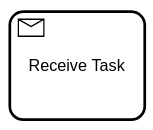

Receive tasks are tasks which references a message. They are used to wait until a proper message is received.



When a receive task is entered then a corresponding message subscription is created. The process instance stops at this point and waits until the message is correlated.

A message can published using one of the Zeebe clients. When the message is correlated, the receive task gets completed and the process instance continues.

> An alternative to receive tasks are [message intermediate catch events](../../bpmn-processes/message-events/message-events.md) which behaves the same but can be used together with event-based gateways.

## Messages

A message can be referenced by one or more receive tasks. It **must** define the name of the message (e.g. `Money collected`) and the `correlationKey` expression (e.g. `= orderId`).

Usually, the name of the message is defined as a static value (e.g. `order canceled`), but it can also be defined as [expression](/product-manuals/concepts/expressions.md) (e.g. `= "order " + awaitingAction`). The expression is evaluated on activating the receive task and must result in a `string`.

The `correlationKey` is an expression that usually [accesses a variable](/product-manuals/concepts/expressions.md#access-variables) of the process instance that holds the correlation key of the message. The expression is evaluated on activating the receive task and must result either in a `string` or in a `number`.

In order to correlate a message to the receive task, the message is published with the defined name (e.g. `Money collected`) and the **value** of the `correlationKey` expression. For example, if the process instance has a variable `orderId` with value `"order-123"` then the message must be published with the correlation key `"order-123"`.

## Variable mappings

By default, all message variables are merged into the process instance. This behavior can be customized by defining an output mapping at the receive task.

## Additional resources

### XML Representation
A receive task with message definition:

```xml
<bpmn:message id="Message_1iz5qtq" name="Money collected">
   <bpmn:extensionElements>
     <zeebe:subscription correlationKey="orderId" />
   </bpmn:extensionElements>
</bpmn:message>

<bpmn:receiveTask id="money-collected" name="Money collected"
  messageRef="Message_1iz5qtq">
</bpmn:receiveTask>
```

### References

- [Message correlation](/product-manuals/concepts/messages.md)
- [Expressions](/product-manuals/concepts/expressions.md)
- [Variable mappings](/product-manuals/concepts/variables.md#inputoutput-variable-mappings)
- [Incidents](/product-manuals/concepts/incidents.md)
