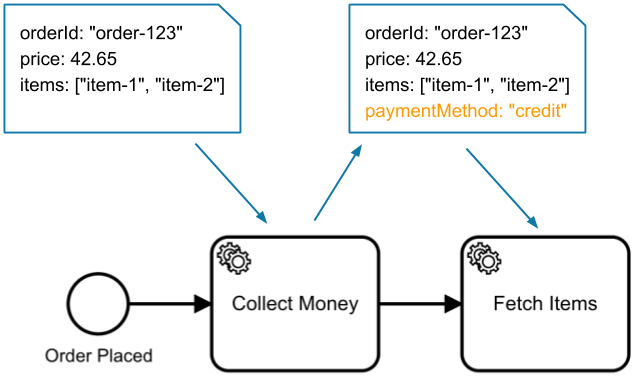
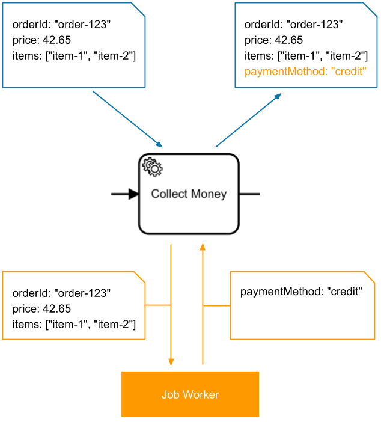
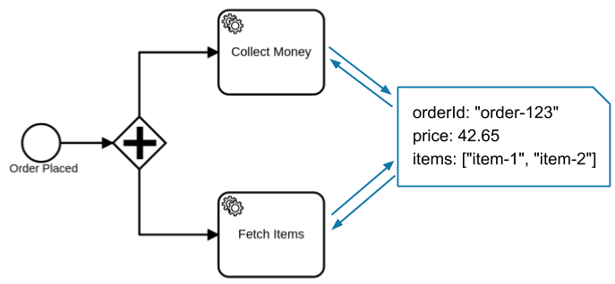

Every BPMN workflow instance can have one or more variables. Variables are key-value-pairs and hold
the contextual data of the workflow instance that is required by job workers to do their work or to
decide which sequence flows to take. They can be provided when a workflow instance is created, when
a job is completed, and when a message is correlated.

## Job workers

By default, a job worker gets all variables of a workflow instance. It can limit the data by
providing a list of required variables as _fetchVariables_.

The worker uses the variables to do its work. When the work is done, it completes the job. If the
result of the work is needed by follow-up tasks, then the worker sets the variables while completing
the job. These variables are [merged](/product-manuals/concepts/variables.md#variable-propagation) into the
workflow instance.

If the job worker expects the variables in a different format or under different names then the variables can be transformed by defining _input mappings_ in the workflow. _Output mappings_ can be used to transform the job variables before merging them into the workflow instance.

## Variable scopes vs. token-based data

A workflow can have concurrent paths, for example, when using a parallel gateway. When the execution reaches the parallel gateway then new tokens are spawned which execute the following paths concurrently.

Since the variables are part of the workflow instance and not of the token, they can be read globally from any token. If a token adds a variable or modifies the value of a variable then the changes are also visible to concurrent tokens.

The visibility of variables is defined by the _variable scopes_ of the workflow.

## Concurrency considerations

When multiple active activities exist in a workflow instance (i.e. there is a form of concurrent
execution, e.g. usage of a parallel gateway, multiple outgoing sequence flows or a parallel
multi-instance marker), you may need to take extra care in dealing with variables. When variables
are altered by one activity, it might also be accessed and altered by another at the same time. Race
conditions can occur in such workflows.

We recommend taking care when writing variables in a parallel flow. Make sure the variables are
written to the correct [variable scope](/product-manuals/concepts/variables.md#variable-scopes) using variable
mappings and make sure to complete jobs and publish messages only with the minimum required
variables.

These type of problems can be avoided by:

- passing only updated variables
- using output variable mappings to customize the variable propagation
- using an embedded subprocess and input variable mappings to limit the visibility and propagation of variables

## Additional resources

- [Job handling](/product-manuals/concepts/job-workers.md)
- [Variables](/product-manuals/concepts/variables.md)
- [Input/output variable mappings](/product-manuals/concepts/variables.md#inputoutput-variable-mappings)
- [Variable scopes](/product-manuals/concepts/variables.md#variable-scopes)
