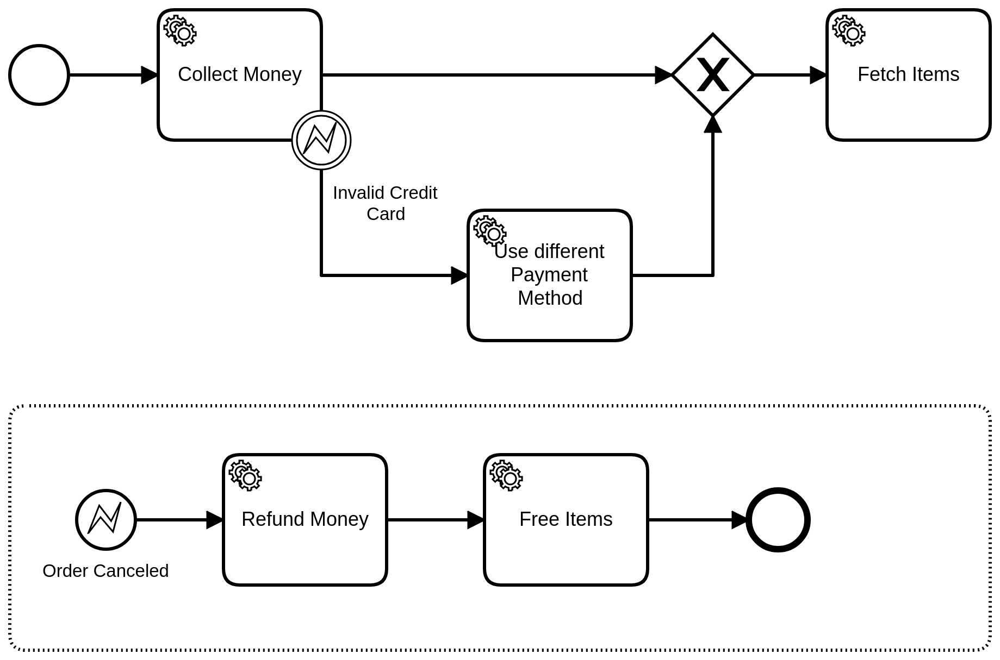
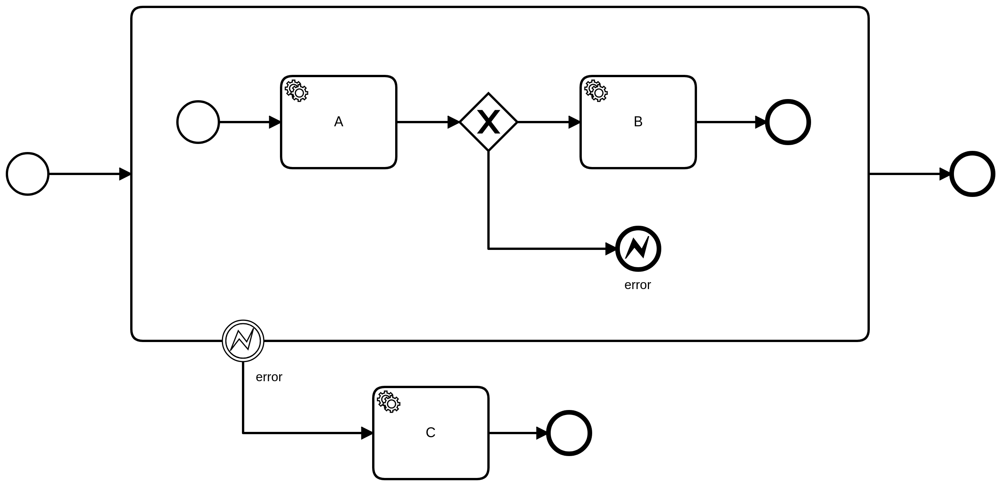
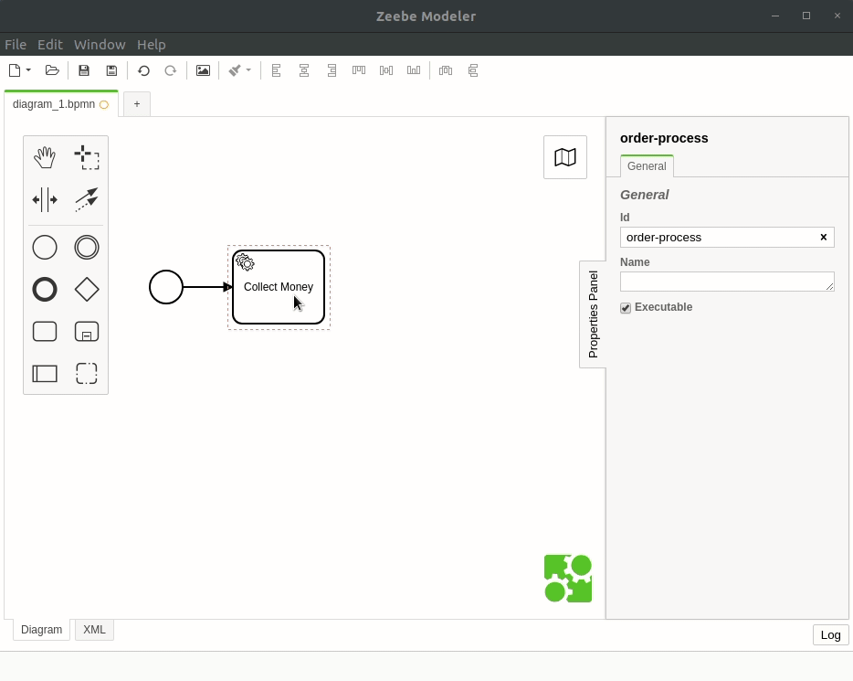

Error events are events which reference an error. They are used to handle business errors in a workflow.



An error indicates that some kind of business error has occurred which should be handled in the workflow, for example, by taking a different path to compensate the error.

## Defining the Error

An error can be referenced by one or more error events. It must define the `errorCode` (e.g. `Invalid Credit Card`) of the error.

The `errorCode` is a `string` that must match to the error code that is sent by the client command or from the error end event.

## Catching the Error

An error can be caught using an error **boundary event** or an error **event subprocess**.

The boundary event or the event subprocess must be interrupting. When the error is caught then the service task gets terminated and the boundary event or event subprocess gets activated. That means the workflow instance continues where the error is caught instead of following the regular path.

An error is caught by the first event in the scope hierarchy that matches the error code. If the error is thrown form a service task then it can be caught by an attached boundary event. If the task has no boundary event or the error code does not match then the error is propagated to the parent or root scope of the workflow instance.

In case the workflow instance is created via call activity, the error can also be caught in the calling parent workflow instance.

## Throwing the Error

An error can be thrown from a **client command** while processing a job. See the [gRPC command](/reference/grpc.md#throwerror-rpc) for details.

Alternatively, an error can also be thrown inside a workflow using an error **end event**.



## Unhandled Errors

When an error is triggered then it should be handled in the workflow. If it is not handled (e.g. unexpected error code) then an **incident** is raised to indicate the failure. The incident is attached to the corresponding service task of the processed job or the error end event.

The incident can not be solved by the user because the failure is in the workflow itself that can not be changed to handle the error for this workflow instance.

## Business Error vs. Technical Error

While processing a job, two different types of errors can be occurred: a technical error (e.g. database connection interrupted) and a business error (e.g. invalid credit card).

A technical error is usually unexpected and should not be handled in the workflow. The error may disappear when the job is retried, or an incident is created to indicate that an user interaction is required.

A business error is expected and is handled in the workflow. The workflow may take a different path to compensate the error or undo previous actions.

## Additional Resources

 <details>
   <summary>XML representation</summary>
   <p>A boundary error event:

```xml
<bpmn:error id="invalid-credit-card-error" errorCode="Invalid Credit Card" />

<bpmn:boundaryEvent id="invalid-credit-card" name="Invalid Credit Card" attachedToRef="collect-money">
 <bpmn:errorEventDefinition errorRef="invalid-credit-card-error" />
</bpmn:boundaryEvent>

```

   </p>
 </details>

 <details>
   <summary>Using the BPMN modeler</summary>
   <p>Adding an error boundary event:



   </p>
 </details>

 <details>
   <summary>Workflow Lifecycle</summary>
   <p>Workflow instance records of an error boundary event:

 <table>
     <tr>
         <th>Intent</th>
         <th>Element Id</th>
         <th>Element Type</th>
     </tr>
     <tr>
         <td>EVENT_OCCURRED</td>
         <td>collect-money</td>
         <td>SERVICE_TASK</td>
     </tr>
     <tr>
       <td>ELEMENT_TERMINATING</td>
       <td>collect-money</td>
       <td>SERVICE_TASK</td>
     </tr>
     <tr>
        <td>ELEMENT_TERMINATED</td>
        <td>collect-money</td>
        <td>SERVICE_TASK</td>
      </tr>
      <tr>
         <td>ELEMENT_ACTIVATING</td>
         <td>invalid-credit-card</td>
         <td>BOUNDARY_EVENT</td>
     </tr>
     <tr>
         <td>ELEMENT_ACTIVATED</td>
         <td>invalid-credit-card</td>
         <td>BOUNDARY_EVENT</td>
     </tr>
     <tr>
         <td>ELEMENT_COMPLETING</td>
         <td>invalid-credit-card</td>
         <td>BOUNDARY_EVENT</td>
     </tr>
     <tr>
         <td>ELEMENT_COMPLETED</td>
         <td>invalid-credit-card</td>
         <td>BOUNDARY_EVENT</td>
     </tr>
 </table>

   </p>
 </details>

References:

- [Incidents](/product-manuals/concepts/incidents.md)
