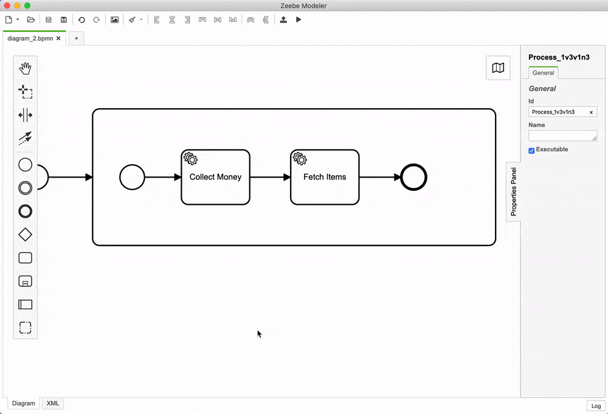

Timer events are events which are triggered by a defined timer.


## Timer Start Events

A workflow can have one or more timer start events (besides other types of start events). Each of the timer events must have either a **time date or time cycle** definition.

When a workflow is deployed then it schedules a timer for each timer start event. Scheduled timers of the previous version of the workflow (based on the BPMN process id) are canceled.

When a timer is triggered then a new workflow instance is created and the corresponding timer start event is activated.

## Intermediate Timer Catch Events

An intermediate timer catch event must have a **time duration** definition that defines when it is triggered.

When an intermediate timer catch event is entered then a corresponding timer is scheduled. The workflow instance stops at this point and waits until the timer is triggered. When the timer is triggered, the catch event gets completed and the workflow instance continues.

## Timer Boundary Events

An interrupting timer boundary event must have a **time duration** definition. When the corresponding timer is triggered then the activity gets terminated. Interrupting timer boundary events is often used to model timeouts, for example, canceling the processing after 5 minutes and do something else.

An non-interrupting timer boundary event must have either a **time duration or time cycle** definition. When the activity is entered then it schedules a corresponding timer. If the timer is triggered and it is defined as time cycle with repetitions > 0 then it schedules the timer again until the defined number of repetitions is reached. Non-interrupting timer boundary events is often used to model notifications, for example, contacting the support if the processing takes longer than one hour.

## Timers

Timers must be defined by providing either a date, a duration, or a cycle.

A timer can be defined either as a static value (e.g. `PT3D`) or as an [expression](/product-manuals/concepts/expressions.md). There are two common ways for using an expression:

- [access a variable](/product-manuals/concepts/expressions.md#access-variables) (e.g. `= remainingTime`)
- [using temporal values](/product-manuals/concepts/expressions.md#temporal-expressions) (e.g. `= date and time(expirationDate) - date and time(creationDate)`)

If the expression belongs to a timer start event of the workflow then it is evaluated on deploying the workflow. Otherwise, it is evaluated on activating the timer catch event. The evaluation must result either in a `string` that has the same ISO 8601 format as the static value or an equivalent temporal value (i.e. a date-time, a duration, or a cycle).

### Time Date

A specific point in time defined as ISO 8601 combined date and time representation. It must contain a timezone information, either `Z` for UTC or a zone offset. Optionally, it can contain a zone id.

- `2019-10-01T12:00:00Z` - UTC time
- `2019-10-02T08:09:40+02:00` - UTC plus 2 hours zone offset
- `2019-10-02T08:09:40+02:00[Europe/Berlin]` - UTC plus 2 hours zone offset at Berlin

### Time Duration

A duration defined as ISO 8601 durations format.

- `PT15S` - 15 seconds
- `PT1H30M` - 1 hour and 30 minutes
- `P14D` - 14 days

If the duration is zero or negative then the timer will fire immediately.

### Time Cycle

A cycle defined as ISO 8601 repeating intervals format. It contains the duration and the number of repetitions. If the repetitions are not defined then the timer will be repeated infinitely until it is canceled.

- `R5/PT10S` - every 10 seconds, up to 5 times
- `R/P1D` - every day, infinitely

## Additional Resources

<details>
  <summary>XML representation</summary>
  <p>A timer start event with time date:

```xml
 <bpmn:startEvent id="release-date">
  <bpmn:timerEventDefinition>
    <bpmn:timeDate>2019-10-01T12:00:00Z</bpmn:timeDate>
  </bpmn:timerEventDefinition>
</bpmn:startEvent>
```

An intermediate timer catch event with time duration:

```xml
<bpmn:intermediateCatchEvent id="coffee-break">
  <bpmn:timerEventDefinition>
    <bpmn:timeDuration>PT10M</bpmn:timeDuration>
  </bpmn:timerEventDefinition>
</bpmn:intermediateCatchEvent>
```

A non-interrupting boundary timer event with time cycle:

```xml
<bpmn:boundaryEvent id="reminder" cancelActivity="false" attachedToRef="process-order">
  <bpmn:timerEventDefinition>
    <bpmn:timeCycle>R3/PT1H</bpmn:timeCycle>
  </bpmn:timerEventDefinition>
</bpmn:boundaryEvent>
```

  </p>
</details>

<details>
  <summary>Using the BPMN modeler</summary>
  <p>Adding an interrupting timer boundary event:



  </p>
</details>

<details>
  <summary>Workflow Lifecycle</summary>
  <p>Workflow instance records of a timer start event:

<table>
    <tr>
        <th>Intent</th>
        <th>Element Id</th>
        <th>Element Type</th>
    </tr>
    <tr>
        <td>EVENT_OCCURRED</td>
        <td>release-date</td>
        <td>START_EVENT</td>
    </tr>
    <tr>
        <td>ELEMENT_ACTIVATING</td>
        <td>release-date</td>
        <td>START_EVENT</td>
    </tr>
    <tr>
        <td>ELEMENT_ACTIVATED</td>
        <td>release-date</td>
        <td>START_EVENT</td>
    </tr>
    <tr>
        <td>ELEMENT_COMPLETING</td>
        <td>release-date</td>
        <td>START_EVENT</td>
    </tr>
    <tr>
        <td>ELEMENT_COMPLETED</td>
        <td>release-date</td>
        <td>START_EVENT</td>
    </tr>
</table>

Workflow instance records of an intermediate timer catch event:

<table>
    <tr>
        <th>Intent</th>
        <th>Element Id</th>
        <th>Element Type</th>
    </tr>
    <tr>
        <td>ELEMENT_ACTIVATING</td>
        <td>coffee-break</td>
        <td>INTERMEDIATE_CATCH_EVENT</td>
    </tr>
    <tr>
        <td>ELEMENT_ACTIVATED</td>
        <td>coffee-break</td>
        <td>INTERMEDIATE_CATCH_EVENT</td>
    </tr>
    <tr>
        <td>...</td>
        <td>...</td>
        <td>...</td>
    </tr>
    <tr>
        <td>EVENT_OCCURRED</td>
        <td>coffee-break</td>
        <td>INTERMEDIATE_CATCH_EVENT</td>
    </tr>
    <tr>
        <td>ELEMENT_COMPLETING</td>
        <td>coffee-break</td>
        <td>INTERMEDIATE_CATCH_EVENT</td>
    </tr>
    <tr>
        <td>ELEMENT_COMPLETED</td>
        <td>coffee-break</td>
        <td>INTERMEDIATE_CATCH_EVENT</td>
    </tr>
</table>

  </p>
</details>

References:

- [Expressions](/product-manuals/concepts/expressions.md)
- [ISO 8601](https://en.wikipedia.org/wiki/ISO_8601)
