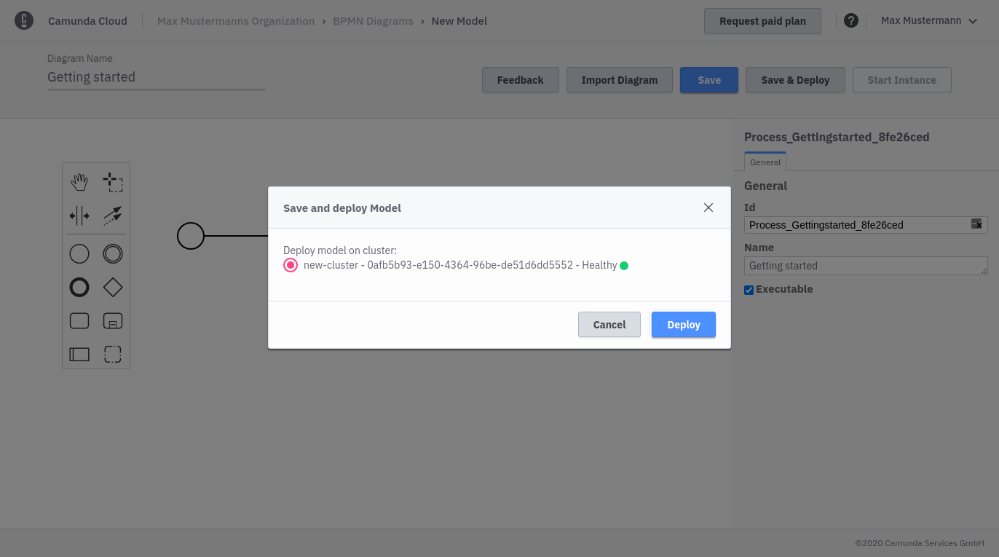
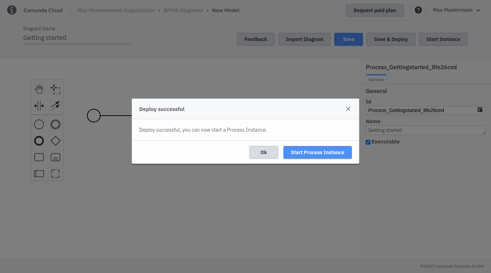
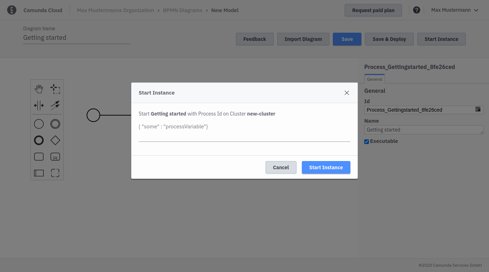
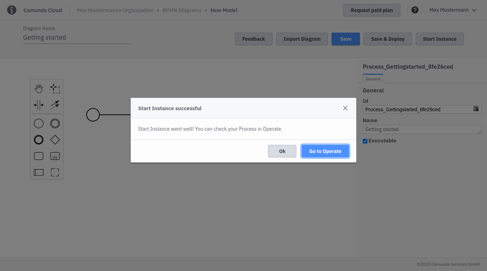
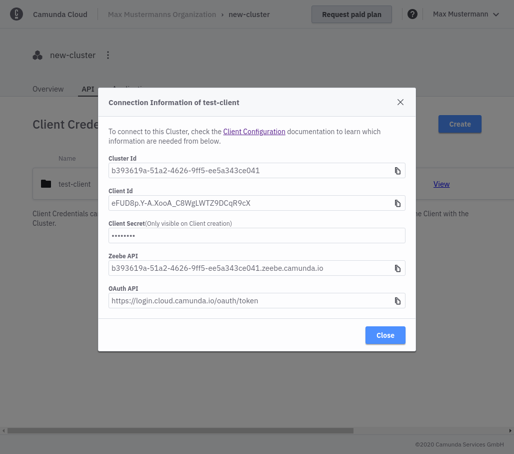

import Tabs from "@theme/Tabs";
import TabItem from "@theme/TabItem";

<Tabs groupId="modeler" defaultValue="console" values={
    [
        {label: 'Console Modeler', value: 'console', },
        {label: 'Zeebe Modeler', value: 'desktop', },
    ]
}>


<TabItem value='console'>

You can now use the "Save & Deploy" button to deploy the newly created process to your cluster



Deployment can take a few seconds, but you should get a confirmation for successfull deployment.



You can now start a new process instance. For this example you can just start an instance with an empty payload.



Once the instance is started, you'll get a confirmation with a link to jump into Operate directly.




</TabItem>


<TabItem value='desktop'>

On the right side of the navigation menu there are buttons for deploying and starting workflows.


In the deployment dialog, the connection information must now be specified: Cluster Id, Client Id and Client Secret.

 Client Id and Cluster Id can be retrieved by clicking on the _View_ link on the client in the _API_-Tab.




The Client Secret can be retrieved from the downloaded connection file:


```bash
grep SECRET  ~/Downloads/CamundaCloudMgmtAPI-Client-test-client.txt
export ZEEBE_CLIENT_SECRET='zbzsZI_6UnCsH_CIo0lNUN8qGyvLJr9VrH77ewNm8Oq3elvhPvV7g.QmJGydzOLo' 
```

Click Deploy to **deploy** the workflow. Use the Play button from the navigation to **start a new instance**.

</TabItem>
</Tabs>
