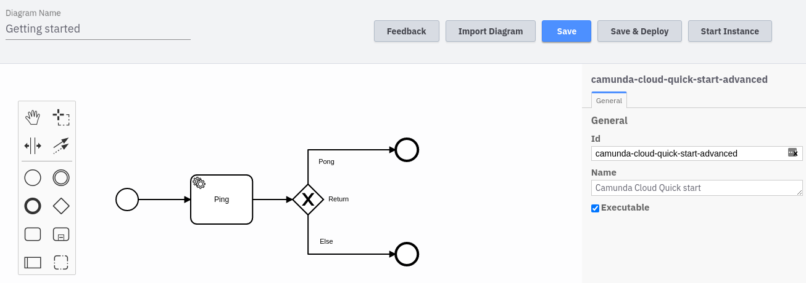
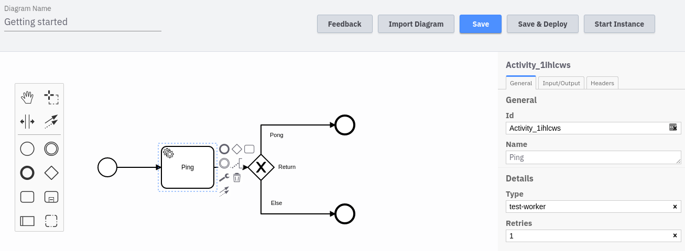
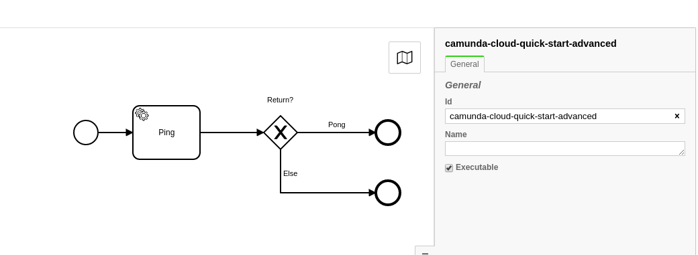
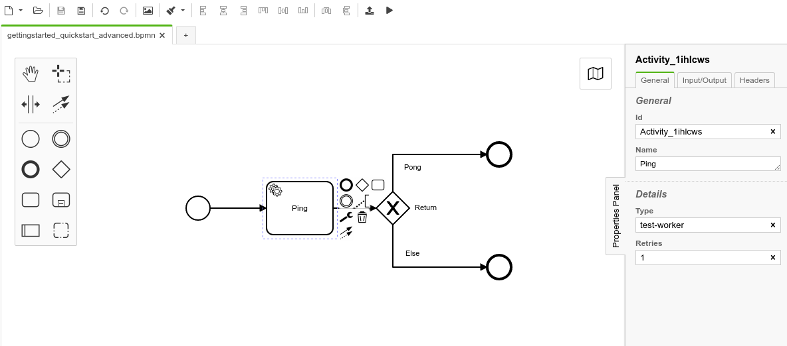

import Tabs from '@theme/Tabs';
import TabItem from '@theme/TabItem';

Use [This workflow model](./bpmn/gettingstarted_quickstart_advanced.bpmn) for the tutorial.

<Tabs groupId="modeler" defaultValue="console" values={
[
{label: 'Console Modeler', value: 'console', },
{label: 'Zeebe Modeler', value: 'desktop', },
]
}>

<TabItem value='console'>

Use the "Import Diagram" button to inject the BPMN-model you just downloaded into the diagram



This workflow includes a Service Task and an XOR Gateway. Select the Service Task and fill in the properties. Set the task-type to 'test-worker'.



Deploy the new workflow using the "Save & Deploy" button.

Make sure you have [created a client](./setup-client-connection-credentials.md) and [connected a cluster](connect-to-your-cluster.md).

</TabItem>

<TabItem value='desktop'>



This workflow includes a Service Task and an XOR Gateway. Select the Service Task and fill in the properties. Set the task-type to 'test-worker'.



Deploy the new workflow.

</TabItem>
</Tabs>

Now you can connect a worker for the configured service task:

```bash
zbctl create worker test-worker --handler "echo {\"return\":\"Pong\"}"
```
